# Лабораторная работа №2

## Тема

**Введение в AWS: вычислительные сервисы (EC2)**  
Полный цикл развёртывания веб-сервера в облаке с автоматизацией через User Data

---

## 👤 Студент

- **Имя и фамилия:** Савка Никита (Savca Nichita)
- **Группа:** I2302
- **Платформа разработки:** macOS (Apple Silicon), VS Code, MACOS Терминал
- **Среда выполнения:** AWS (консоль и CLI), регион — EU (Frankfurt) `eu-central-1`
- **Дата выполнения:** октябрь 2025

---

## 🎯 Цель и постановка задачи

**Цель:**  
Познакомиться с основными вычислительными сервисами AWS, настроить безопасный доступ (IAM), включить бюджет «Zero-Spend», развернуть виртуальную машину EC2 (Amazon Linux 2023), автоматически установить Nginx через User Data, проверить мониторинг и журналы, подключиться по SSH и развернуть статический сайт (вариант 6А).

**Задачи:**

1. Настроить IAM: создать группу `Admins` с `AdministratorAccess` и пользователя `cloudstudent`
2. Включить бюджет Zero-Spend для контроля расходов
3. Запустить EC2 инстанс t3.micro с Amazon Linux 2023 и User Data для автоматической установки Nginx
4. Проверить мониторинг (CloudWatch), статус-чеки и системные логи
5. Подключиться по SSH и развернуть статический сайт (вариант 6А)
6. Корректно остановить инстанс через AWS CLI

---

## 📐 Архитектура и роли компонентов

| Компонент                  | Роль                                                                                              |
| -------------------------- | ------------------------------------------------------------------------------------------------- |
| **IAM**                    | Безопасный доступ: группа `Admins` с политикой `AdministratorAccess`, пользователь `cloudstudent` |
| **Budgets**                | Бюджет «Zero-Spend» — уведомляет о любых расходах > $0                                            |
| **EC2**                    | ВМ t3.micro (Free Tier), AMI Amazon Linux 2023                                                    |
| **User Data (cloud-init)** | Автоустановка пакетов и запуск Nginx при первом старте                                            |
| **Security Group**         | Входящий трафик: HTTP 80/tcp (Any) и SSH 22/tcp (My IP)                                           |
| **CloudWatch**             | Базовый мониторинг (5 мин), статус-чеки (2/2)                                                     |
| **SSH/SCP**                | Подключение к инстансу и загрузка статических файлов сайта                                        |
| **Nginx**                  | Отдача статических страниц по HTTP (порт 80/tcp)                                                  |

---

## 🚀 Ход выполнения

### 0️⃣ Подготовка аккаунта и региона

1. Зарегистрировался в AWS (Free Tier), выполнил вход в консоль под root для первичной настройки
2. В правом верхнем углу консоли выбрал регион **EU (Frankfurt)** `eu-central-1`

> 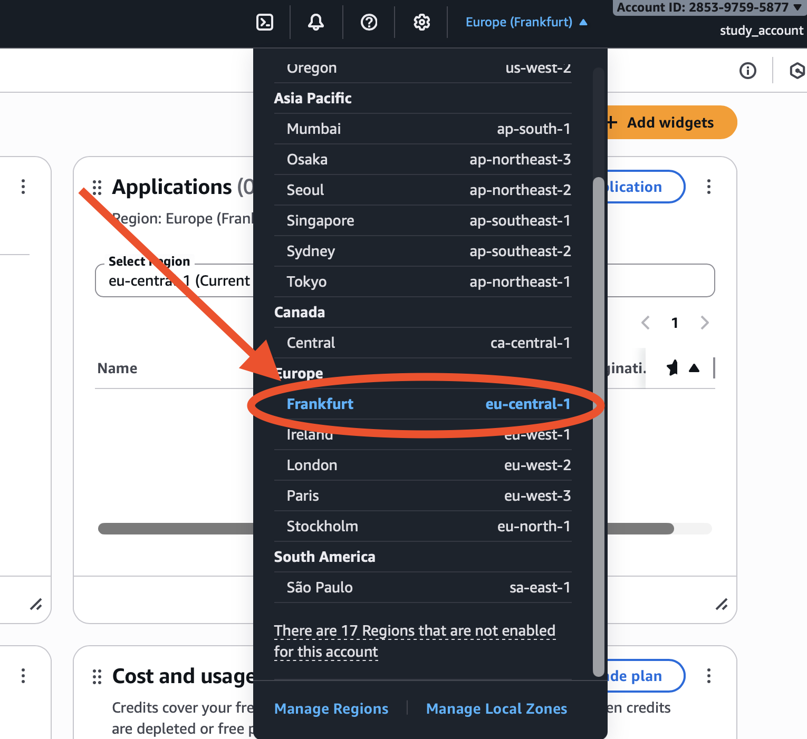

### 1️⃣ IAM: группа и пользователь

**Создание группы:**

1. Открыл **IAM → User groups → Create group**
   - Имя: `Admins`
   - Прикрепил политику `AdministratorAccess`
   - Нажал **Create group**

**Создание пользователя:** 2. **IAM → Users → Create user**

- Имя: `cloudstudent`
- Включил Console access (временный пароль при создании)
- Добавил в группу `Admins`

3. Вышел из root и вошёл под IAM-пользователем `cloudstudent`

> 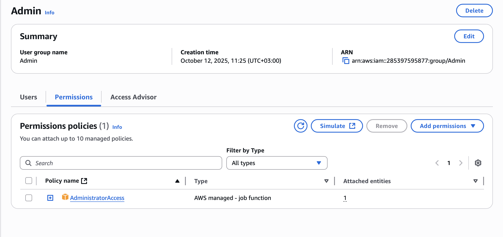

> 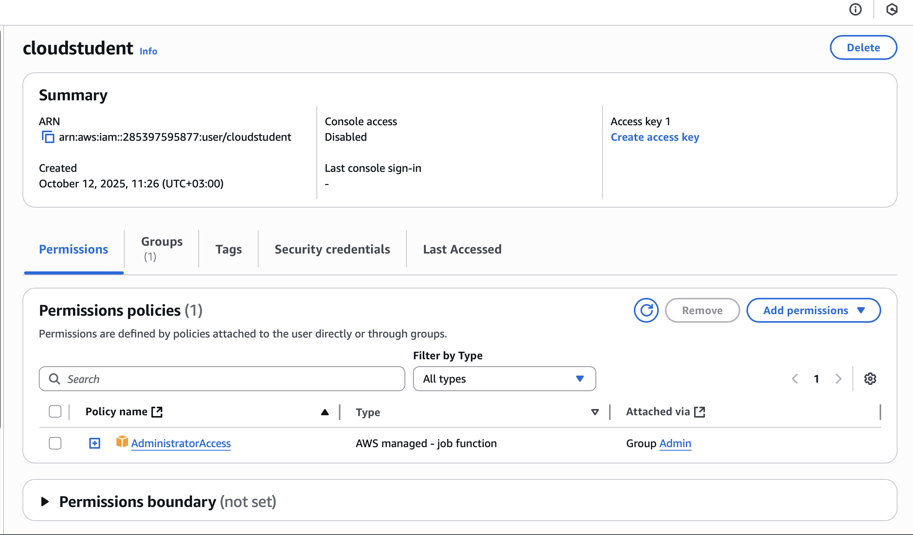

#### ❓ Контрольный вопрос: что делает AdministratorAccess?

**Ответ:** Даёт полный доступ ко всем сервисам и ресурсам AWS.

---

### 2️⃣ Zero-Spend Budget

1. Открыл **Billing & Cost Management → Budgets → Create budget**
2. Выбрал шаблон **Zero spend budget**, задал:
   - Name: `ZeroSpend`
   - Email recipients: мой e-mail
3. Нажал **Create**

> 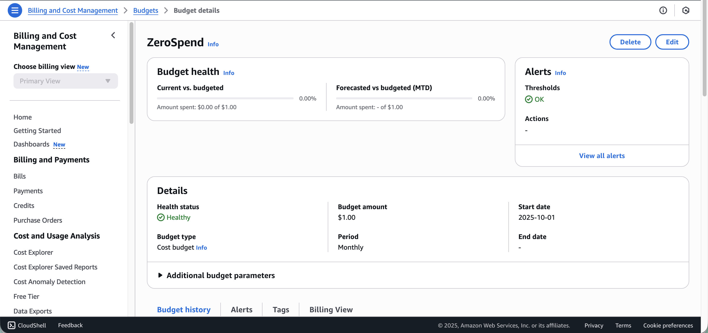

---

### 3️⃣ EC2: запуск виртуальной машины с User Data

**Параметры запуска:**

1. **EC2 → Instances → Launch instances**
   - Name: `webserver`
   - AMI: **Amazon Linux 2023**
   - Instance type: **t3.micro**
   - Key pair: создал `cloudstudent-keypair` (.pem) и скачал локально
   - Security group: `webserver-sg`
     - Inbound: HTTP 80/tcp — Anywhere (0.0.0.0/0)
     - Inbound: SSH 22/tcp — My IP
   - Storage: по умолчанию
   - **Advanced details → User Data:**

```bash
#!/bin/bash
dnf -y update
dnf -y install htop
dnf -y install nginx
systemctl enable nginx
systemctl start nginx
```

2. Нажал **Launch instance** и дождался **Running** и **Status checks: 2/2**

> 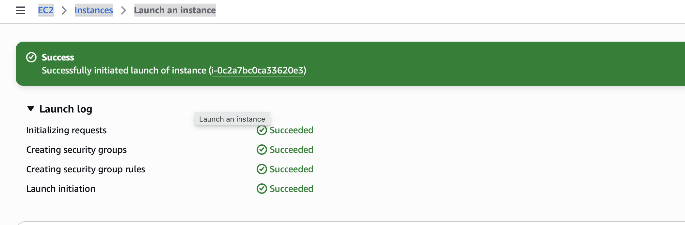

> 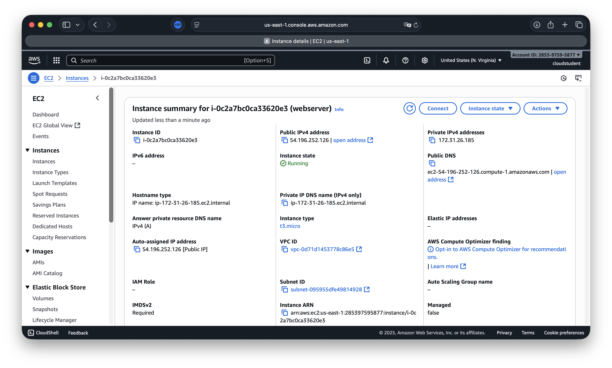

**Проверка доступности HTTP:**  
Открыл в браузере `http://<Public-IP>` — отдалась дефолтная страница Nginx

> 

#### ❓ Контрольный вопрос: что такое User Data и зачем nginx?

**Ответ:** User Data — скрипт первичной инициализации (cloud-init), выполняется при первом запуске, автоматизирует установку/настройку. Nginx — веб-сервер, слушает 80/tcp и отдаёт сайт.

---

### 4️⃣ Диагностика и мониторинг

**Проверки:**

- **Status checks:** System reachability и Instance reachability — оба passed (2/2)
- **Monitoring (CloudWatch):** открыл метрики и увеличил один график (Enlarge). По умолчанию активен Basic monitoring (5 мин)
- **System Log:** Actions → Monitor and troubleshoot → Get system log — увидел строки установки пакетов из User Data
- **Instance Screenshot:** Actions → Monitor and troubleshoot → Get instance screenshot — убедился, что ОС жива

> 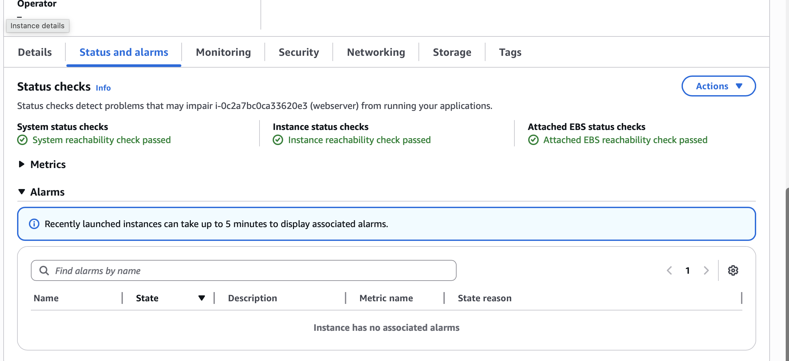

> 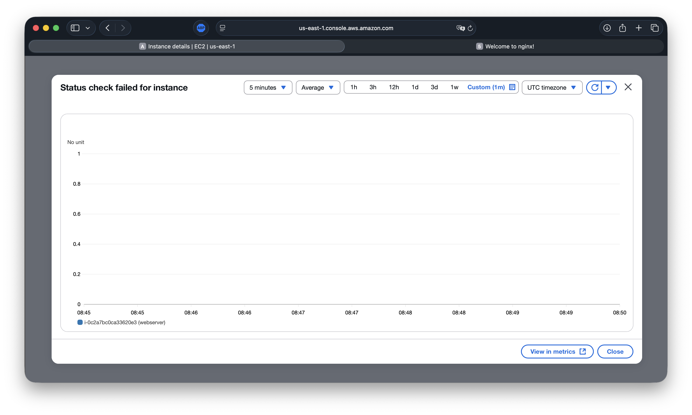

> 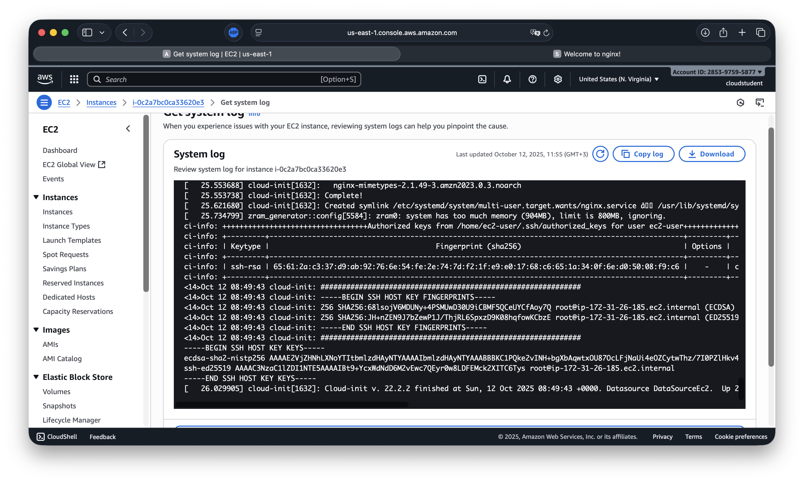

> 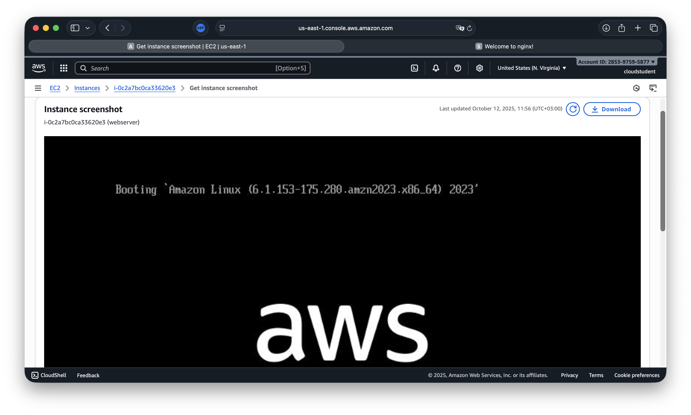

#### ❓ Контрольный вопрос: когда нужен Detailed monitoring (1 мин)?

**Ответ:** При автоскейлинге, точных SLO/алертах или необходимости поминутной телеметрии для глубокой диагностики.

---

### 5️⃣ Подключение по SSH и проверка сервисов

**На macOS в каталоге с ключом:**

```bash
cd /PATH/TO/KEY
chmod 400 cloudstudent-keypair.pem
ssh -i cloudstudent-keypair.pem ec2-user@<Public-IP>
```

**Проверил nginx:**

```bash
systemctl status nginx
```

> 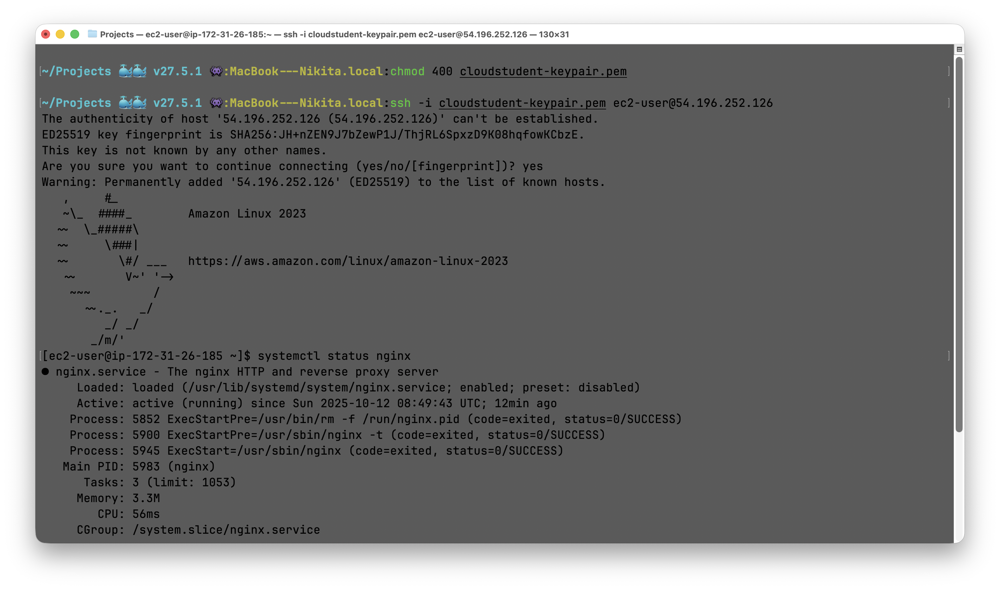

#### ❓ Контрольный вопрос: почему не пароль по SSH?

**Ответ:** Парольная аутентификация отключена; используется ключ — безопаснее, устойчиво к перебору; пароль не хранится/не передаётся.

---

### 6️⃣ Вариант 6А: Развёртывание статического сайта

**Подготовка локально:**  
Подготовил файлы: `index.html`, `about.html`, `contact.html`, `styles.css`, `app.js`

**Загрузка файлов по scp:**

```bash
scp -i cloudstudent-keypair.pem \
  index.html about.html contact.html styles.css app.js \
  ec2-user@<Public-IP>:/tmp/
```

**Перемещение файлов на инстансе:**

```bash
ssh -i cloudstudent-keypair.pem ec2-user@<Public-IP>

# на инстансе:
sudo mkdir -p /usr/share/nginx/html
sudo mv /tmp/{index,about,contact}.html /tmp/{styles.css,app.js} /usr/share/nginx/html/
sudo ls -l /usr/share/nginx/html
```

**Проверка в браузере:**

```
http://<Public-IP>
http://<Public-IP>/about.html
http://<Public-IP>/contact.html
```

> 

> 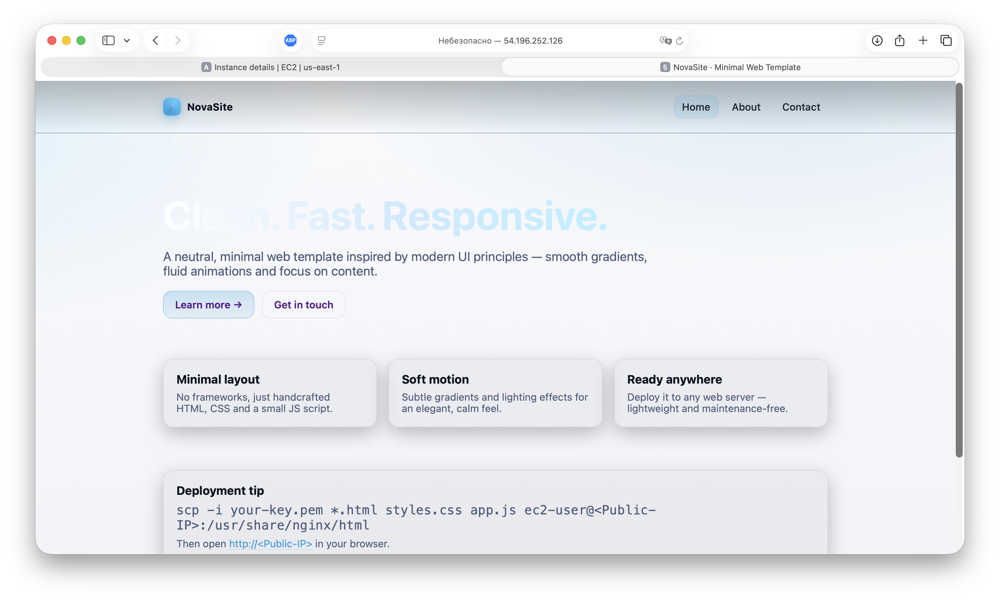

#### ❓ Контрольный вопрос: что делает команда scp?

**Ответ:** Secure Copy — безопасно копирует файлы по SSH-каналу (шифрование, аутентификация ключом).

---

### 7️⃣ Завершение: остановка инстанса через AWS CLI

**Настройка CLI:**

```bash
aws configure
# AWS Access Key ID: ****
# AWS Secret Access Key: ****
# Default region name: eu-central-1
# Default output format: json
```

**Остановка инстанса:**

```bash
aws ec2 stop-instances --instance-ids i-xxxxxxxxxxxxxxxxx --region eu-central-1
```

> 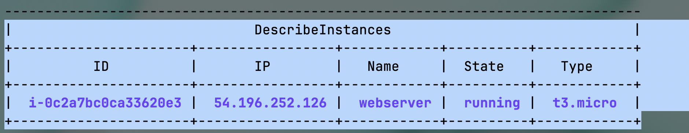

> 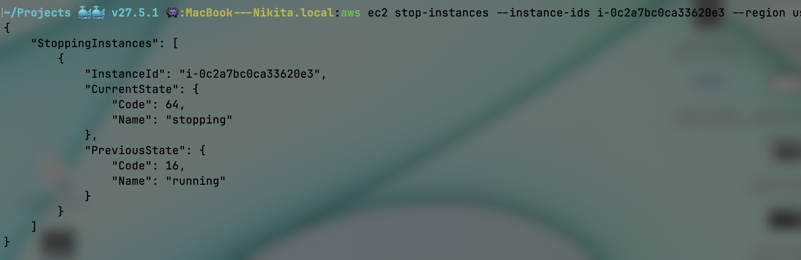

#### ❓ Контрольный вопрос: Stop vs Terminate?

**Ответ:** **Stop** — останавливает инстанс, сохраняет EBS-диск/настройки (можно запустить позже; Public IP может измениться). **Terminate** — удаляет инстанс (и обычно EBS, если включено), восстановить нельзя.

---

## 💡 Ответы на контрольные вопросы (сводно)

1. **AdministratorAccess:** Полные права на все сервисы/ресурсы AWS
2. **User Data:** Сценарий cloud-init при первом старте; автоматическая установка/настройка (здесь — Nginx)
3. **Для чего Nginx:** Веб-сервер, отдаёт статические страницы и/или проксирует запросы
4. **Когда Detailed monitoring:** Когда нужна поминутная телеметрия для алертов/автоскейлинга/тонкой диагностики
5. **SSH без пароля:** Безопаснее (ключ), парольная аутентификация отключена
6. **scp:** Secure copy по SSH (шифрование, ключ)
7. **Stop vs Terminate:** Stop — сохранить и остановить; Terminate — удалить

---

## 📚 Источники

- [AWS Documentation: IAM](https://docs.aws.amazon.com/iam/)
- [AWS Documentation: Budgets](https://docs.aws.amazon.com/cost-management/latest/userguide/budgets-managing-costs.html)
- [AWS Documentation: EC2](https://docs.aws.amazon.com/ec2/)
- [AWS Documentation: CloudWatch](https://docs.aws.amazon.com/cloudwatch/)
- [Amazon Linux 2023](https://docs.aws.amazon.com/linux/al2023/)
- [User Data and cloud-init](https://docs.aws.amazon.com/AWSEC2/latest/UserGuide/user-data.html)
- [Nginx Documentation](https://nginx.org/en/docs/)

---

## 🎓 Выводы

Выполнен полный цикл развёртывания вычислительной инфраструктуры на AWS в рамках Free Tier:

1. ✅ Настроен безопасный доступ через IAM (группа `Admins`, пользователь `cloudstudent`)
2. ✅ Подключён бюджет «Zero-Spend» для контроля расходов
3. ✅ Запущен EC2 (Amazon Linux 2023) с автоматической установкой Nginx через User Data
4. ✅ Убедился в работоспособности через статус-чеки и мониторинг CloudWatch
5. ✅ Подключился по SSH и развернул статический сайт (вариант 6А)
6. ✅ Корректно остановил инстанс через AWS CLI

Работа показала, как минимальными средствами и по лучшим практикам поднять веб-сервис в облаке с упором на **безопасность**, **наблюдаемость** и **воспроизводимость** шагов.
