# ☁️ Лабораторная работа №3

**Облачные сети в AWS (VPC, Subnets, IGW, NAT, Route Tables, SG, EC2)** — полный отчёт со скриншотами

---

## 📋 Студент

- **Имя и фамилия:** Савка Никита (Savca Nichita)
- **Группа:** I2302
- **Рабочая станция:** macOS (Apple Silicon), VS Code, встроенный Терминал
- **Среда выполнения:** AWS Console (+ немного AWS CLI), регион — EU (Frankfurt) eu-central-1
- **Дата выполнения:** октябрь 2025
- **Формат сдачи:** README.md (Markdown) + папка screenshots/ со скриншотами

---

## 🎯 Цель и суть работы

**Цель:** Вручную собрать облачную сеть в AWS: создать VPC, 2 подсети (публичную и приватную), Internet Gateway, NAT Gateway, 2 таблицы маршрутов, 3 Security Group, и развернуть 3 EC2-инстанса (web, db, bastion) с корректной связностью:

- Веб-сервер в публичной подсети доступен из Интернета по HTTP.
- Сервер БД в приватной подсети не доступен извне.
- Доступ к приватной зоне — только через bastion host.
- Приватные инстансы выходят в Интернет через NAT Gateway (для обновлений и пакетов).

В конце я отдельно объясняю, почему по условиям задания подключиться к БД с бастиона по `mysql -h 10.22.2.201` не получится, и перечисляю варианты, что нужно изменить, чтобы это удалось.

---

## Концепция архитектуры (как это работает)

- **VPC** — изолированная виртуальная сеть с моим адресным пространством `10.22.0.0/16`.
- **Public Subnet** — подсеть, у которой маршрут по умолчанию `0.0.0.0/0` указывает на IGW + инстансы имеют Public IP.
- **Private Subnet** — подсеть без прямого маршрута на IGW; исход в Интернет — только через NAT GW в публичной подсети.
- **Route Tables** — определяют направления трафика; привязка RT к подсети делает правила активными.
- **Security Groups** — stateful-фаерволы на уровне инстансов.
- **Bastion Host** — «прыжковая» машина в public subnet, единственная точка SSH-доступа в приватную зону.
- **NAT GW** — управляемый сервис SNAT: приватные исходящие соединения проходят в Интернет под единым Elastic IP.

> 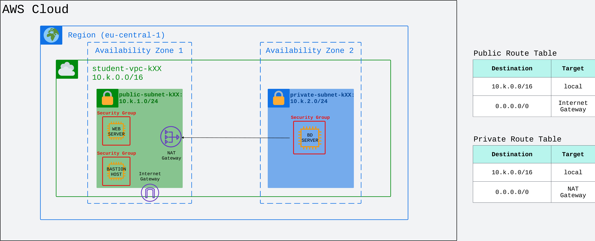

---

## Ход выполнения (пошагово, как делал я)

Именование скриншотов: `lab3_XX__кратко.png`.

### Шаг 1. Подготовка

Зашёл в AWS Console под IAM-пользователем и в правом верхнем углу выбрал регион EU (Frankfurt) eu-central-1. В строке поиска открыл сервис VPC.

> 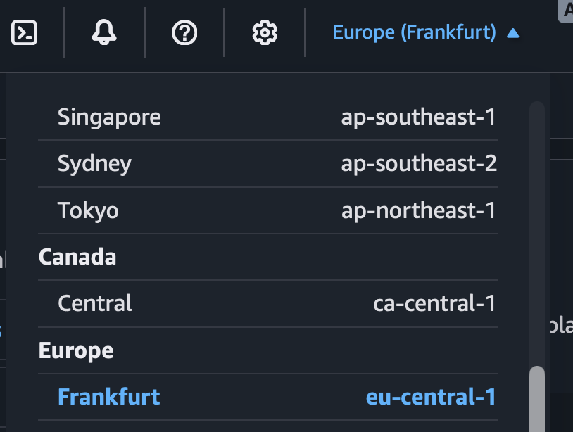

---

### Шаг 2. Создал VPC

VPC → Your VPCs → Create VPC.

- **Name:** student-vpc-k22
- **IPv4 CIDR block:** 10.22.0.0/16
- **Tenancy:** Default → Create

**Вопрос:** Что даёт маска /16, и почему не /8?  
**Ответ (кратко):** /16 ≈ 65 тыс. адресов — разумно для VPC и лабораторки; /8 слишком велик (≈ 16 млн), неудобен, конфликтный и не нужен.

> 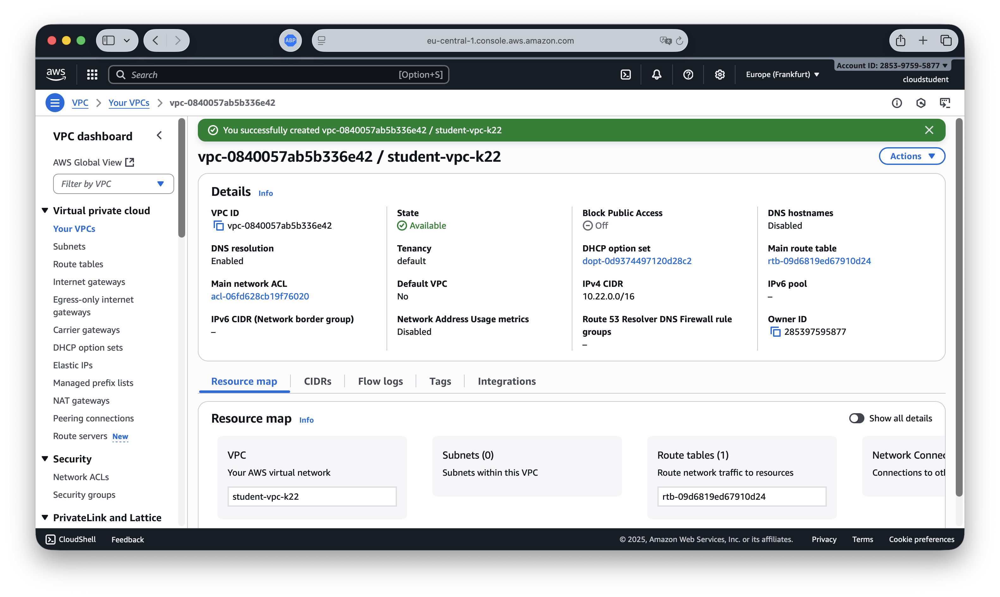

---

### Шаг 3. Создал и прикрепил Internet Gateway

VPC → Internet Gateways → Create internet gateway.

- **Name:** student-igw-k22 → Create  
  Выбрал IGW → Actions → Attach to VPC → student-vpc-k22.

> 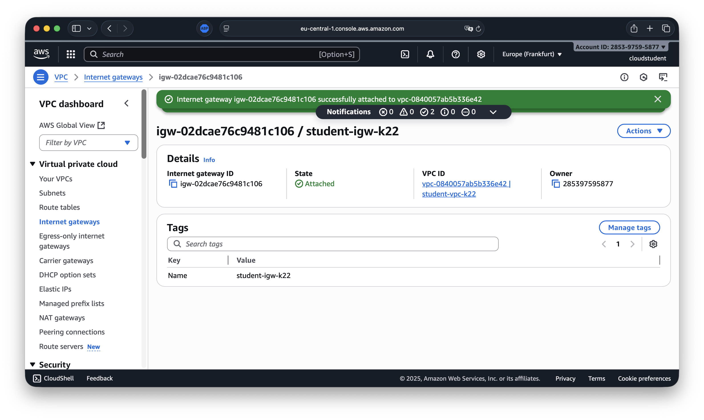

---

### Шаг 4. Создал подсети

#### 4.1 Публичная подсеть

Subnets → Create subnet.

- **VPC:** student-vpc-k22
- **Subnet name:** public-subnet-k22
- **AZ:** eu-central-1a
- **CIDR:** 10.22.1.0/24 → Create

**Вопрос:** Подсеть уже «публичная»? — Нет. Её делает публичной только маршрут `0.0.0.0/0` → IGW в её Route Table + Public IP у инстанса.

> 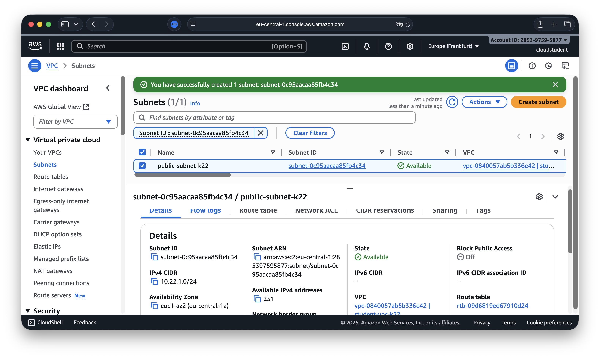

#### 4.2 Приватная подсеть

Subnets → Create subnet.

- **VPC:** student-vpc-k22
- **Subnet name:** private-subnet-k22
- **AZ:** eu-central-1b
- **CIDR:** 10.22.2.0/24 → Create

**Вопрос:** Подсеть «приватная»? — Да, по умолчанию, пока у неё нет маршрута на IGW; позже добавлю `0.0.0.0/0` → NAT.

> 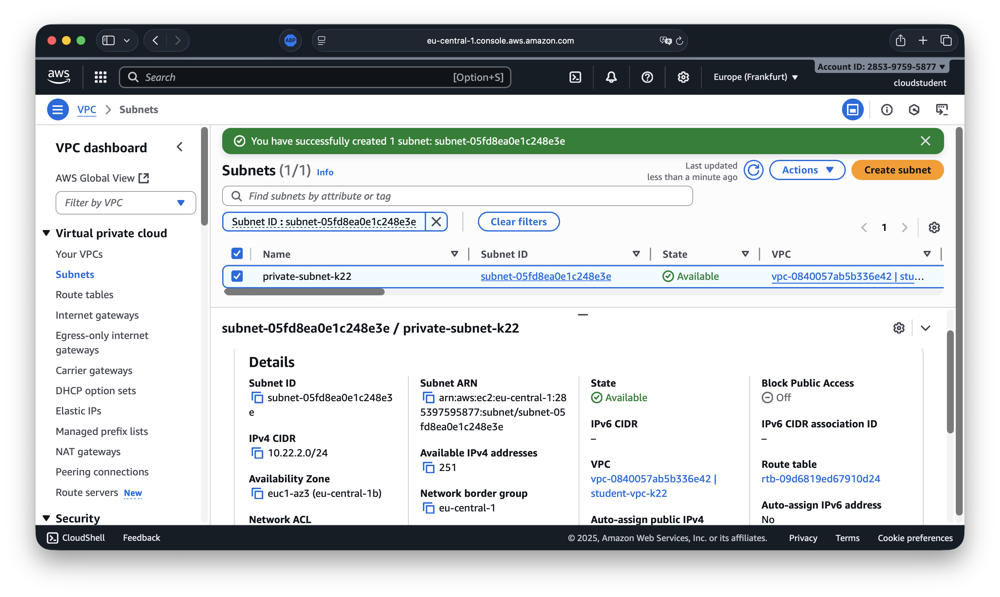

---

### Шаг 5. Таблицы маршрутов

#### 5.1 Public Route Table

Route Tables → Create route table.

- **Name:** public-rt-k22
- **VPC:** student-vpc-k22 → Create

Routes → Edit routes → Add route:

- **Destination:** 0.0.0.0/0
- **Target:** Internet Gateway → student-igw-k22 → Save

Subnet associations → Edit → отметил public-subnet-k22 → Save.

Зачем привязывать RT к подсети? Иначе маршруты не применяются к трафику этой подсети.

> 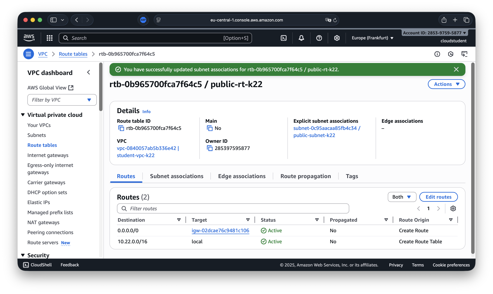

#### 5.2 Private Route Table

Create route table.

- **Name:** private-rt-k22
- **VPC:** student-vpc-k22 → Create

Subnet associations → Edit → отметил private-subnet-k22 → Save.  
(Маршрут через NAT добавлю после создания NAT GW.)

> 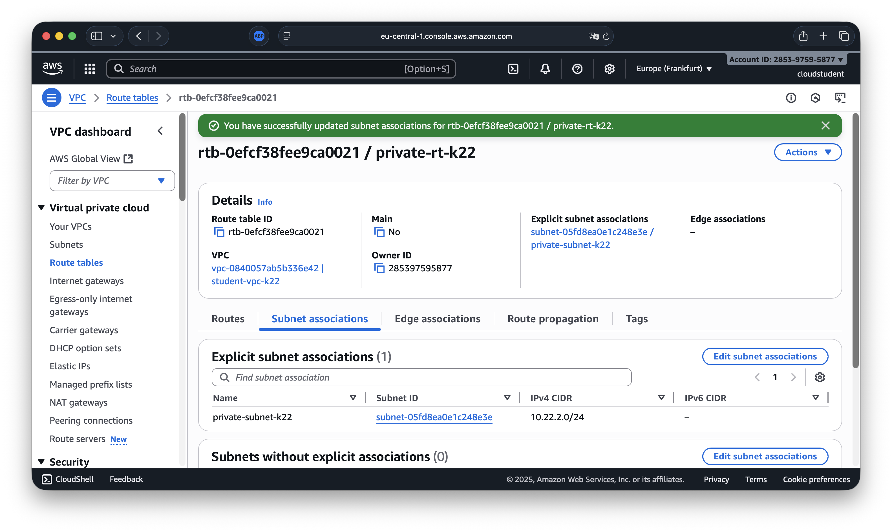

---

### Шаг 6. NAT Gateway + Elastic IP

Как работает NAT GW? Он делает SNAT: исходящие соединения из private-subnet идут наружу под общим Elastic IP NAT-а; входящие «по инициативе Интернета» на приватные инстансы не проходят.

#### 6.1 Elastic IP

Elastic IPs → Allocate Elastic IP address → Allocate.

> 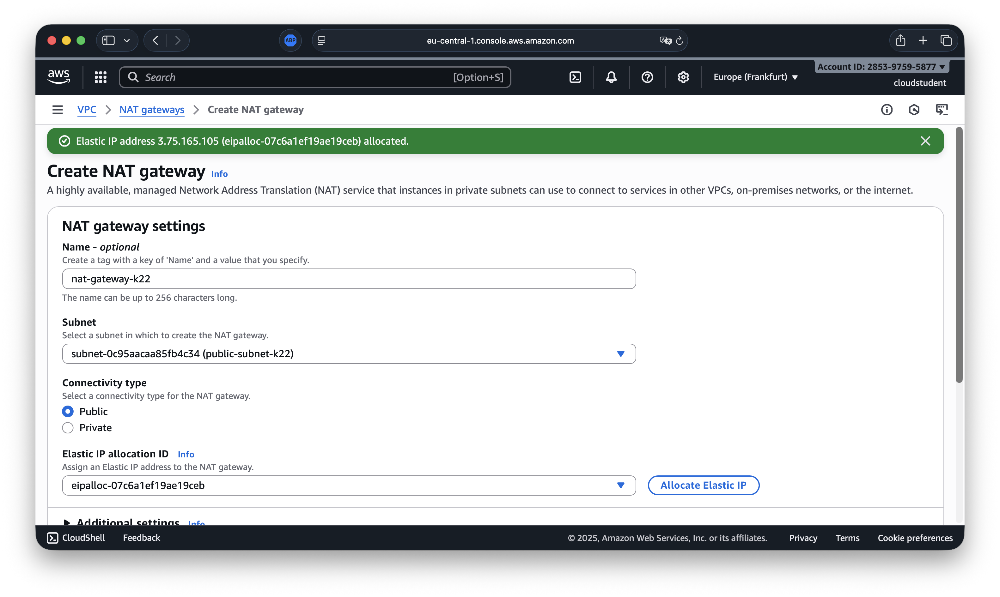

#### 6.2 NAT Gateway

NAT Gateways → Create NAT gateway.

- **Name:** nat-gateway-k22
- **Subnet:** public-subnet-k22
- **Connectivity:** Public
- **Elastic IP:** выбрать созданный EIP → Create  
  Ждал статус Available.

> 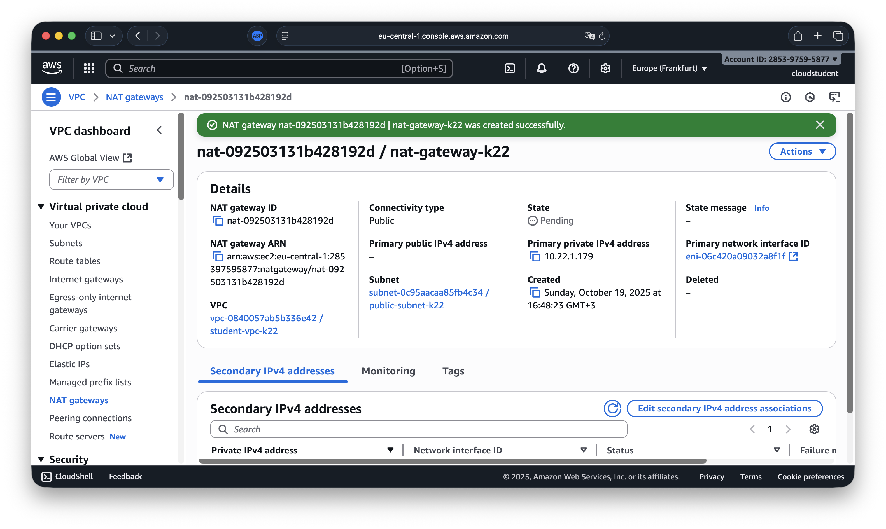

#### 6.3 Маршрут приватной подсети через NAT

Открыл private-rt-k22 → Routes → Edit → Add route:

- **Destination:** 0.0.0.0/0
- **Target:** NAT Gateway → nat-gateway-k22 → Save

> 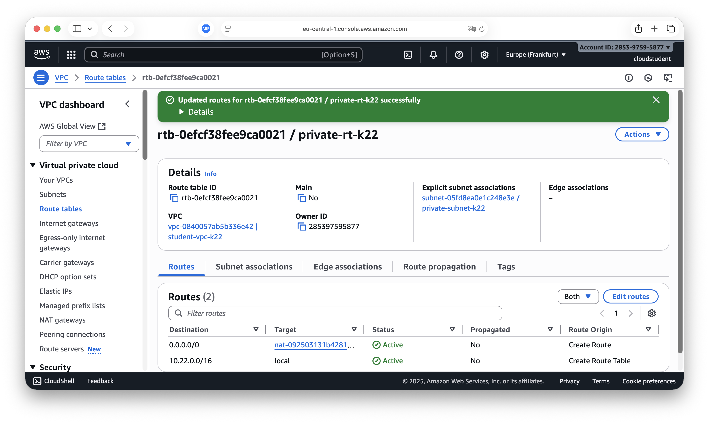

---

### Шаг 7. Security Groups

Создал 3 SG (Outbound — по умолчанию Allow All):

1. **web-sg-k22** (для web-server) — Inbound:
   - HTTP 80/tcp → 0.0.0.0/0
   - HTTPS 443/tcp → 0.0.0.0/0
2. **bastion-sg-k22** (для bastion-host) — Inbound:
   - SSH 22/tcp → My IP (мой текущий белый IP)
3. **db-sg-k22** (для db-server) — Inbound по заданию:
   - MySQL/Aurora 3306/tcp → web-sg-k22 (разрешать доступ к БД только с web-сервера)
   - SSH 22/tcp → bastion-sg-k22 (разрешать SSH к БД только с бастиона)

Что такое Bastion Host? Узел в public subnet — «точка входа» по SSH в приватную зону (ProxyJump/порт-форвардинг), доступ к нему строго ограничен (только с моего IP).

> 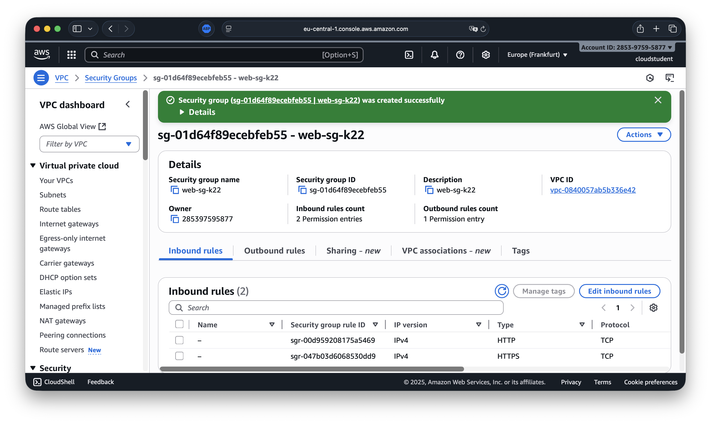

> 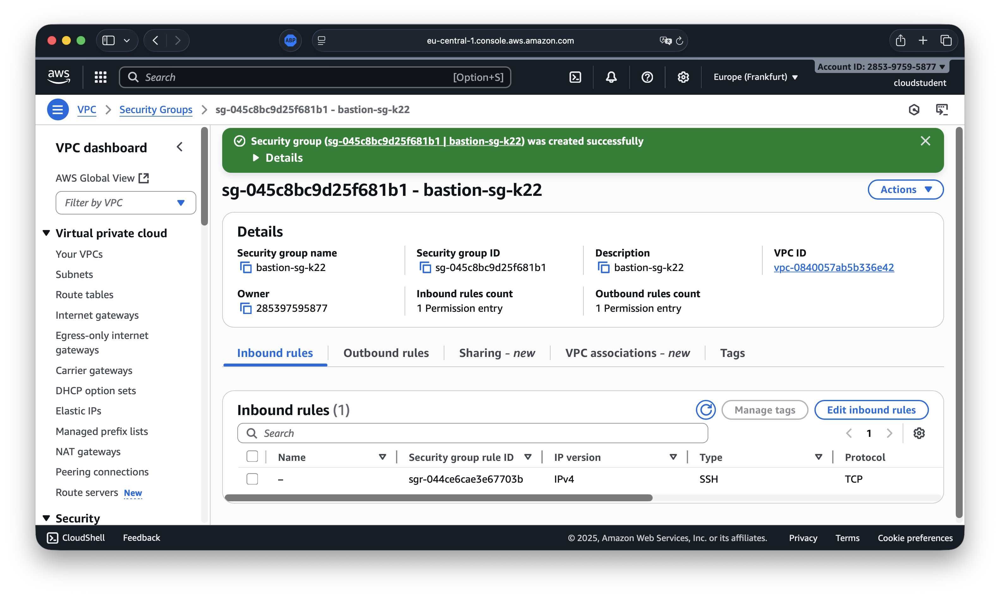

> 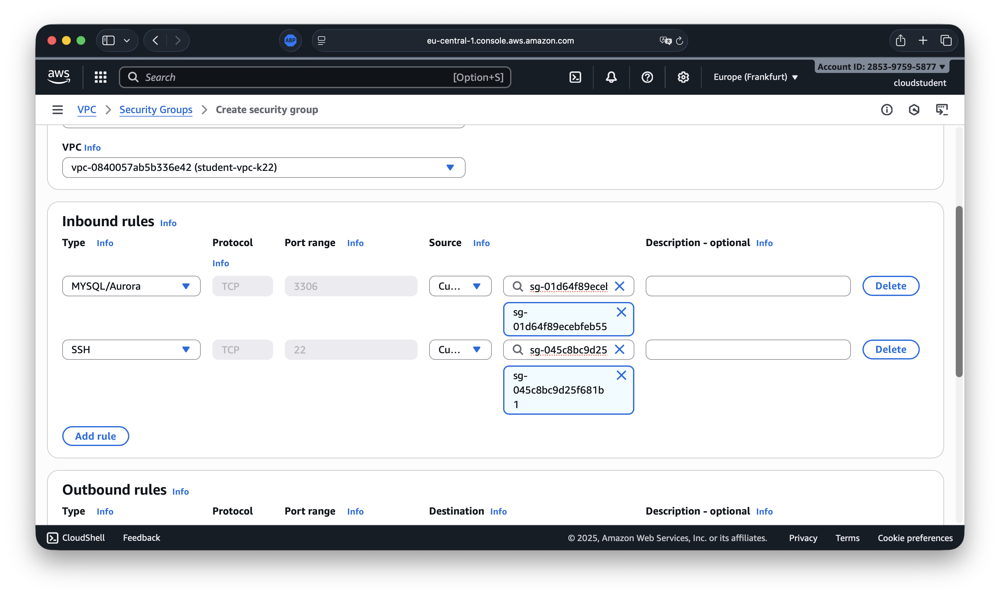

> 

---

### Шаг 8. EC2-инстансы

Общее:

- **AMI:** Amazon Linux 2 (HVM), SSD
- **Type:** t3.micro
- **Key Pair:** student-key-k22 (.pem, скачал и сохранил)
- **Storage:** 8 ГБ (по умолчанию)
- **Тег Name:** web-server / db-server / bastion-host

#### 8.1 web-server (публичная подсеть)

- **VPC:** student-vpc-k22
- **Subnet:** public-subnet-k22
- **Auto-assign Public IP:** Enable
- **SG:** web-sg-k22
- **User data (AL2 / yum):**

```bash
#!/bin/bash
dnf install -y httpd php
echo "<?php phpinfo(); ?>" > /var/www/html/index.php
systemctl enable httpd
systemctl start httpd
```

> 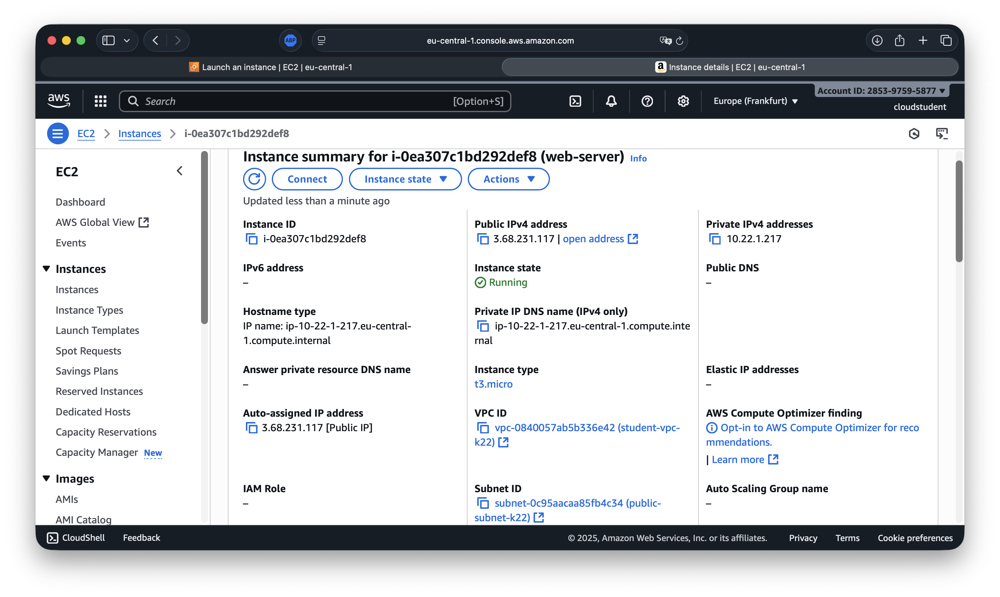

#### 8.2 db-server (приватная подсеть)

- **VPC:** student-vpc-k22
- **Subnet:** private-subnet-k22
- **Auto-assign Public IP:** Disable
- **SG:** db-sg-k22
- **User data (AL2 / yum):**

```bash
#!/bin/bash
dnf install -y mariadb105-server
systemctl enable mariadb
systemctl start mariadb
mysql -e "ALTER USER 'root'@'localhost' IDENTIFIED BY 'StrongPassword123!'; FLUSH PRIVILEGES;"

```

> 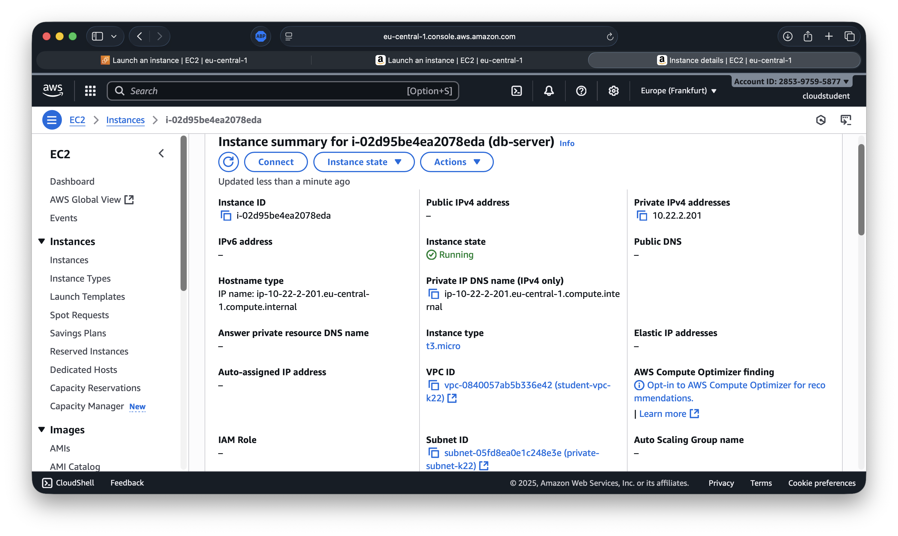

#### 8.3 bastion-host (публичная подсеть)

- **VPC:** student-vpc-k22
- **Subnet:** public-subnet-k22
- **Auto-assign Public IP:** Enable
- **SG:** bastion-sg-k22
- **User data (AL2 / yum):**

```bash
#!/bin/bash
dnf install -y mariadb105

```

> 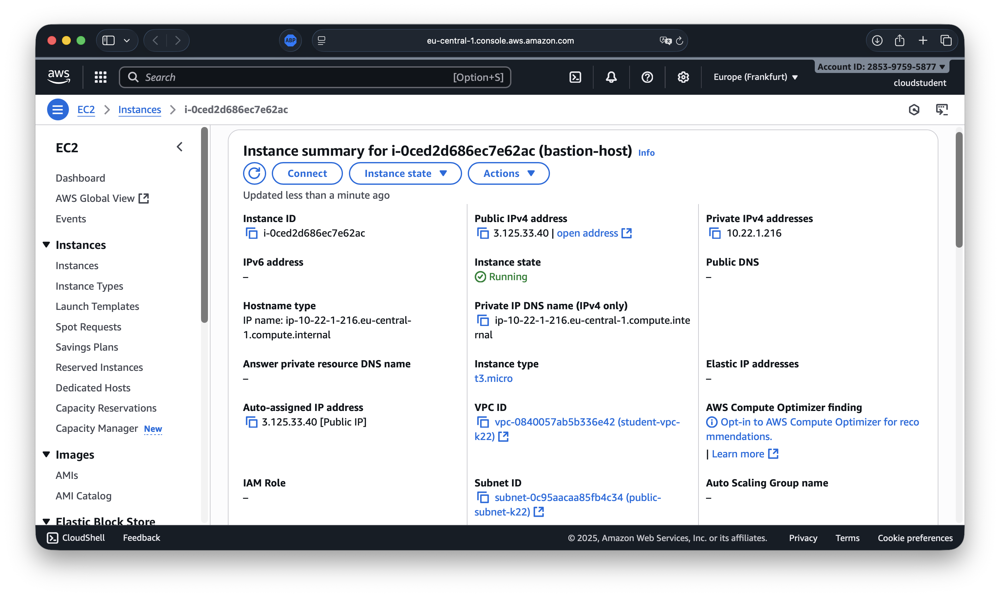

---

### Шаг 9. Проверка связности и объяснение, почему БД «не подключится» с бастиона

#### 1. HTTP-доступ к web

Открыл `http://3.68.231.117` — вижу страницу phpinfo().

> 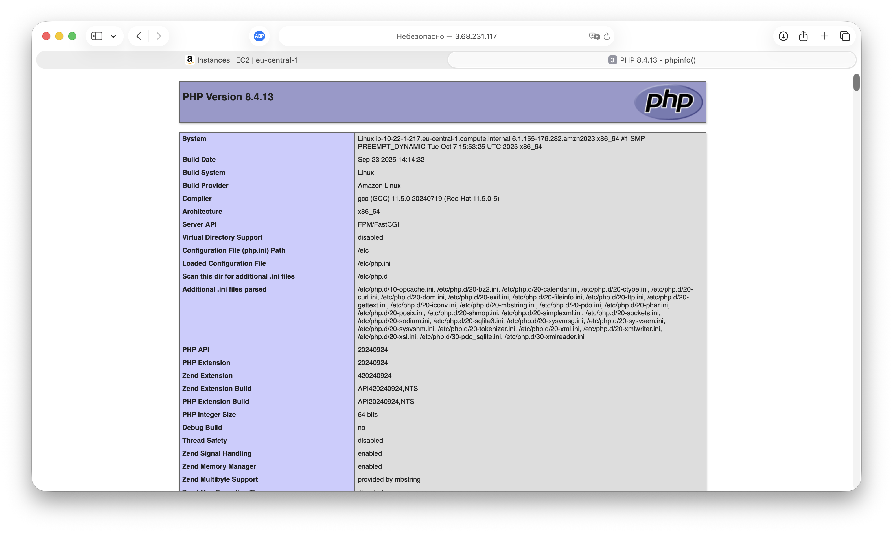

#### 2. SSH на bastion

```bash
chmod 400 student-key-k22.pem
ssh -i student-key-k22.pem ec2-user@3.125.33.40
```

Проверил Интернет:

```bash
ping -c 3 google.com
curl -I https://aws.amazon.com
```

Работает (public subnet + IGW).

> 

#### 3. Попытка подключиться к БД с бастиона (как в задании)

```bash
mysql -h 10.22.2.201 -u root -p
```

Результат: подключение не устанавливается (timeout / Access denied / no route), и это ожидаемо.  
Почему: в db-sg-k22 порт 3306 разрешён только от web-sg-k22, а бастион — в bastion-sg-k22. Значит, трафик с бастиона на 3306 заблокирован SG. Это задано условием — мы намеренно сделали доступ к БД только с веб-сервера (паттерн безопасности).

> 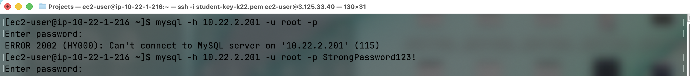

**Это ключевой момент:** По текущим правилам (из задания) подключение к БД с бастиона по 3306 невозможно.  
Поэтому лабораторная часть «проверка mysql с бастиона» логично прерывается на этом шаге.

---

## Почему «не подключилось» с бастиона и что нужно изменить в теории (варианты)

**Факт:** По текущим правилам безопасности (из задания) db-sg-k22 впускает MySQL(3306) только от web-sg-k22. Бастион не входит в этот SG, поэтому `mysql -h 10.22.2.201` с бастиона не пройдёт — и это правильно с точки зрения безопасности.

Если бы нам требовалось проверить подключение, можно сделать одно из:

**Вариант A (наиболее безопасный):**  
Поставить MySQL-клиент на web-сервере (он в web-sg-k22), и выполнить:

```bash
# SSH на web
ssh -i student-key-k22.pem ec2-user@3.68.231.117
sudo yum install -y mariadb
mysql -h 10.22.2.201 -u root -p
```

Это строго соответствует текущему inbound правилу 3306 → web-sg-k22 и ничего не ослабляет.

**Вариант B (только для проверки):**  
В db-sg-k22 временно добавить inbound-правило: MySQL 3306 → bastion-sg-k22 (или на приватный IP бастиона). Выполнить проверку с бастиона:

```bash
mysql -h 10.22.2.201 -u root -p
```

После проверки сразу удалить временное правило.

**Вариант C (локальный CLI на самой БД):**  
SSH с бастиона на db (как я делал) и запустить локальный клиент без сети:

```bash
mysql -u root -p
```

Это не проверяет сетевой доступ с бастиона к 3306, но подтверждает, что MariaDB на db работает.

**Вариант D (SSM Session Manager, продвинутый):**  
Подключать хосты без открытых SSH-портов через AWS Systems Manager (порт-форвардинг SSM). Это вне рамок текущей работы, но хороший паттерн.

В отчёте я фиксирую, что в рамках задания никаких правил не менял, поэтому проверка подключения к БД с бастиона осознанно прервана — так и должно быть при заданных SG.

---

## Завершение и очистка ресурсов (чтобы не платить за NAT)

Минимум: Terminate все EC2, Delete NAT Gateway, Release EIP. Остальное (VPC/RT/SG/подсети) можно оставить — они не тарифицируются.

Через консоль:

1. EC2 → Instances: выбрать web-server, db-server, bastion-host → Instance state → Terminate.
2. NAT Gateways: выбрать nat-gateway-k22 → Delete (дождаться удаления).
3. Elastic IPs: выбрать EIP → Actions → Release.
4. Удалить SG, Subnets, RT, IGW, VPC — строго в обратном порядке зависимостей.

---

## ❓ Контрольные вопросы — мои ответы

| №   | Вопрос                                | Ответ                                                                                   |
| --- | ------------------------------------- | --------------------------------------------------------------------------------------- |
| 1   | /16 и почему не /8                    | /16 — оптимальный размер для VPC, меньше рисков конфликтов; /8 избыточен и непрактичен. |
| 2   | Когда подсеть публичная               | Когда её RT даёт 0.0.0.0/0 → IGW и инстанс имеет Public IP.                             |
| 3   | Когда подсеть приватная               | Когда нет маршрута на IGW; исход в Интернет идёт через NAT GW.                          |
| 4   | Зачем привязка RT к подсети           | Без ассоциации правила RT на подсеть не действуют.                                      |
| 5   | Как работает NAT GW                   | SNAT исходящих соединений приватных хостов под единым EIP.                              |
| 6   | Что такое Bastion Host                | Узел в public subnet — безопасная «точка входа» в приватную зону.                       |
| 7   | Почему не получилось mysql с бастиона | В db-sg-k22 MySQL 3306 разрешён только из web-sg-k22 (по заданию).                      |
| 8   | Что изменить, чтобы получилось        | Расписал в Варианты A/B/C/D выше (предпочтительно A).                                   |

---

## Список скриншотов (референс-таблица)

| №   | Что должно быть видно                   | Путь                                               |
| --- | --------------------------------------- | -------------------------------------------------- |
| 00  | VPC Resource map (общая схема)          | `screenshots/lab3_00__resource_map.png`            |
| 01  | Регион Frankfurt                        | `screenshots/lab3_01__region.png`                  |
| 02  | VPC student-vpc-k22 /16                 | `screenshots/lab3_02__vpc_created.png`             |
| 03  | IGW attached                            | `screenshots/lab3_03__igw_attached.png`            |
| 04  | public-subnet-k22 (/24, eu-central-1a)  | `screenshots/lab3_04__public_subnet.png`           |
| 05  | private-subnet-k22 (/24, eu-central-1b) | `screenshots/lab3_05__private_subnet.png`          |
| 06  | public-rt-k22: 0.0.0.0/0 → IGW + assoc  | `screenshots/lab3_06__public_rt.png`               |
| 07  | private-rt-k22: assoc с private subnet  | `screenshots/lab3_07__private_rt_associated.png`   |
| 08  | Elastic IP allocated                    | `screenshots/lab3_08__eip_allocated.png`           |
| 09  | NAT GW Available                        | `screenshots/lab3_09__nat_available.png`           |
| 10  | private-rt-k22: 0.0.0.0/0 → NAT         | `screenshots/lab3_10__private_rt_nat.png`          |
| 11  | 3 Security Groups (web/bastion/db)      | `screenshots/lab3_11__sgs.png`                     |
| 12  | web-server (Public IP)                  | `screenshots/lab3_12__web_instance.png`            |
| 13  | db-server (без Public IP)               | `screenshots/lab3_13__db_instance.png`             |
| 14  | bastion-host (Public IP)                | `screenshots/lab3_14__bastion_instance.png`        |
| 15  | phpinfo() на web                        | `screenshots/lab3_15__web_phpinfo.png`             |
| 16  | SSH на bastion + ping/curl              | `screenshots/lab3_16__bastion_internet.png`        |
| 17  | Ошибка mysql с бастиона (ожидаемо)      | `screenshots/lab3_17__mysql_fail_from_bastion.png` |
| 18  | SSH на db через -J + htop (NAT ок)      | `screenshots/lab3_18__db_via_bastion_nat_ok.png`   |
| 19  | NAT удалён, EIP освобождён              | `screenshots/lab3_19__nat_eip_deleted.png`         |

---

## Полезные команды (конспект)

**Локально (macOS):**

```bash
chmod 400 student-key-k22.pem
ssh -i student-key-k22.pem ec2-user@3.125.33.40
ssh -i student-key-k22.pem ec2-user@3.68.231.117
ssh -i student-key-k22.pem -J ec2-user@3.125.33.40 ec2-user@10.22.2.201
```

**На bastion:**

```bash
ping -c 3 google.com
curl -I https://aws.amazon.com
# (попытка — ожидаемо проваливается)
mysql -h 10.22.2.201 -u root -p
```

**На db (через ProxyJump):**

```bash
ping -c 3 google.com
sudo yum install -y htop
mysql -u root -p
```

---

## Вывод

Я вручную собрал изолированную сеть в AWS: создал VPC, публичную и приватную подсети, IGW, NAT GW, настроил раздельные Route Tables, создал Security Groups по принципу наименьших привилегий и развернул web / db / bastion.  
Веб-сервер корректно доступен извне; приватный сервер БД изолирован — прямое подключение с бастиона на порт 3306 не допускается ровно так, как предписано заданием (правило db-sg открыто только для web-sg). Я продемонстрировал это и остановил проверку на данном шаге осознанно.  
Я также подтвердил работоспособность NAT (обновления на db проходят) и зафиксировал теоретические варианты, как можно корректно организовать проверку доступа к БД (безопасный — установить клиент на web; временный — добавить правило для bastion и удалить после).  
В завершение я удалил тарифицируемые ресурсы (EC2, NAT GW, EIP), чтобы избежать затрат. Работа оформлена с подробными шагами и скриншотами.
