# ☁️ Лабораторная работа №4

**Amazon S3: публичный и приватный бакеты, загрузка через Console/CLI, Versioning, Lifecycle, Static Website Hosting**

---

## Оглавление

- [Студент](#-студент)
- [Цель и задачи](#-цель-и-задачи)
- [Краткая теория](#-краткая-теория)
- [Что было нужно локально](#-что-было-нужно-локально)
- [Практическая часть (пошагово)](#-практическая-часть-пошагово)
- [Чек-лист](#-чек-лист)
- [Контрольные вопросы — мои ответы](#-контрольные-вопросы--мои-ответы)
- [Структура репозитория](#-структура-репозитория)
- [Стоимость и уборка ресурсов](#-стоимость-и-уборка-ресурсов)
- [Вывод](#-вывод)

---

## Студент

- **Имя и фамилия:** Савка Никита (Savca Nichita)
- **Группа:** I2302
- **Рабочая станция:** macOS (Apple Silicon), VS Code + встроенный Terminal
- **Среда выполнения:** AWS Management Console + AWS CLI, регион — EU (Frankfurt) eu-central-1
- **Дата выполнения:** ноябрь 2025
- **Формат сдачи:** README.md + папка `screenshots/` с пронумерованными изображениями

---

## Цель и задачи

**Цель:**  
Освоить базовые операции с Amazon S3:

- Создать публичный и приватный бакеты.
- Загрузить объекты через консоль и через AWS CLI.
- Включить Versioning, настроить Lifecycle (архивирование логов).
- Развернуть S3 Static Website Hosting.
- Понять разницу между ACL / Object Ownership, роль опции Block all public access, смысл Storage Classes, Bucket Versioning, SSE-S3 / SSE-KMS и Bucket Key.

---

## Краткая теория

> S3 — объектное хранилище: хранит «объекты» (данные + метаданные) в «бакетах».  
> «Папки» в UI — это префиксы ключа (path-подобные строки), а не настоящие каталоги.

- **Object key (ключ объекта):** «виртуальный путь» внутри бакета, например: `avatars/user1.jpg`. Имя файла на диске может отличаться, ключ — уникален внутри бакета.
- **ACL / Object Ownership:**
  - _ACLs enabled_ — можно ставить public-read на уровне объекта (наглядно.
  - _Bucket owner enforced_ — ACL отключены, доступ управляется политиками (современнее/безопаснее в проде).
- **Block all public access:** мастеровыключатель публичности. Если включён — даже public-read не даст доступа по URL.
- **Versioning:** хранит все версии объекта (удобно для отката/истории). Выключение не удаляет старые версии.
- **Lifecycle:** автоматические переходы по Storage Classes (Standard → IA → Glacier …) и удаление по сроку.
- **Шифрование:**
  - _SSE-S3 (AES-256)_ — «просто и безопасно» без явных ключей.
  - _SSE-KMS_ — ключи в KMS; при нём доступна опция Bucket Key (снижает число вызовов KMS → дешевле).  
    В этой лабе шифрование не включал, чтобы не усложнять.

---

## Что было нужно локально

- **AWS CLI** и профиль с регионом eu-central-1:

  ```bash
  aws --version
  aws configure
  # Default region: eu-central-1, output: json
  ```

- **Локальная структура файлов (для загрузок):**

  ```
  s3-lab/
  ├── public/
  │   ├── avatars/
  │   │   ├── user1.jpg
  │   │   └── user2.jpg
  │   └── content/logo.png
  └── private/
      └── logs/activity.csv
  ```

> 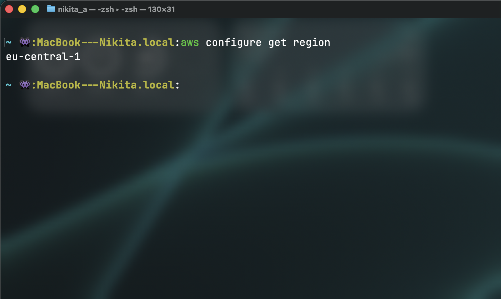  
> 

---

## Практическая часть (пошагово)

### Шаг 0. Открыть S3 в консоли

1. Зайти в AWS Management Console.
2. В верхней панели: нажать `/` или кликнуть Search → ввести S3 → выбрать S3 (Storage).
3. В правом верхнем углу убедиться, что регион EU (Frankfurt) eu-central-1.

> 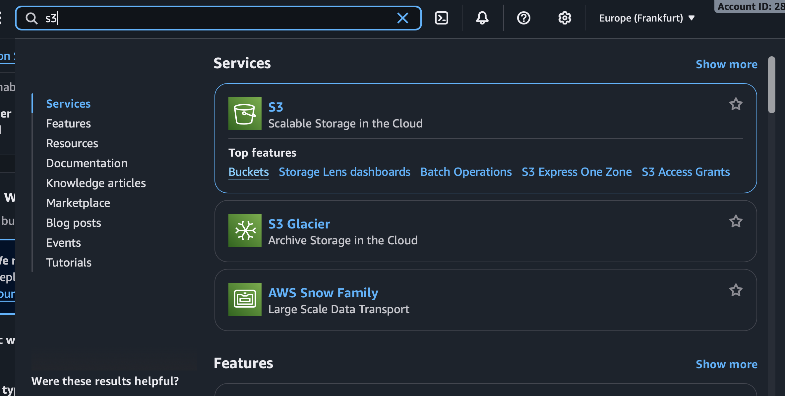

---

### Шаг 1. Создать публичный бакет

- **Bucket name:** `cc-lab4-pub-k22`
- **Region:** EU (Frankfurt) eu-central-1
- **Object Ownership:** ACLs enabled (Can be configured using ACLs)
- **Block Public Access:** снять галочку “Block all public access” → поставить чек подтверждения «I acknowledge…»
- **Versioning / Encryption / Bucket Key:** оставить по умолчанию (Disabled)
- **Create bucket**

> 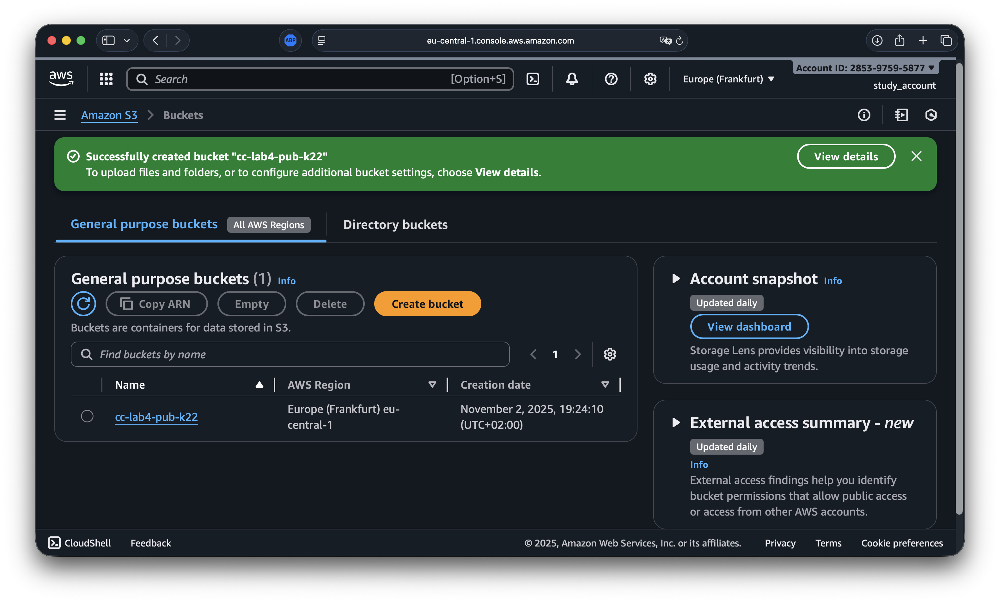

> **Зачем снял Block all public access?**  
> Чтобы наши публичные объекты реально открывались по URL. В противном случае ACL public-read блокировался бы.

---

### Шаг 2. Создать приватный бакет

- **Bucket name:** `cc-lab4-priv-k22`
- **Region:** eu-central-1
- **Object Ownership:** ACLs enabled (для наглядности в лабе)
- **Block Public Access:** ОСТАВИТЬ ВКЛЮЧЁННЫМ (по умолчанию)
- **Остальное — по умолчанию**
- **Create bucket**

> 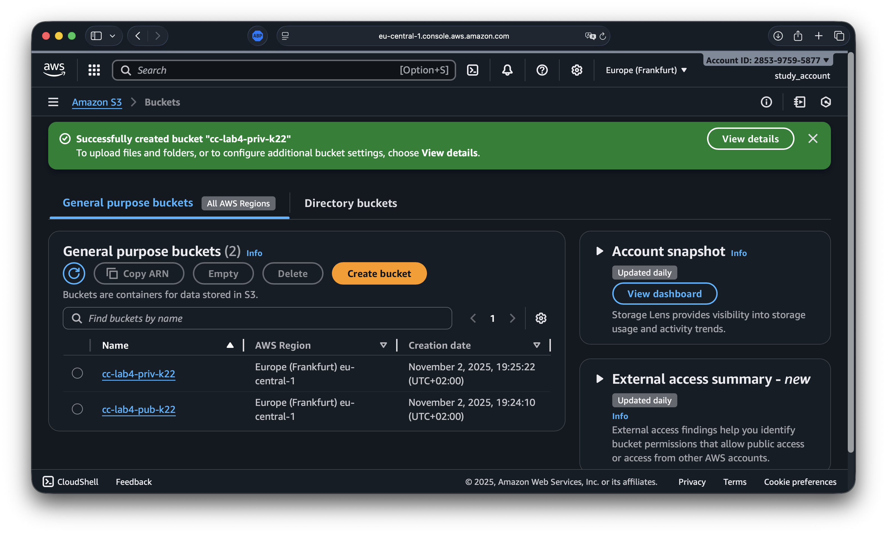

---

### Шаг 3. Загрузка через Console и выдача public-доступа объекту

1. Открываю `cc-lab4-pub-k22` → Create folder →  
   **Folder name:** `avatars/` → Create folder
2. Перехожу в `avatars/` → Upload → перетягиваю `s3-lab/public/avatars/user1.jpg`
3. В секции Permissions ставлю Grant public-read access / Make public → Upload

> 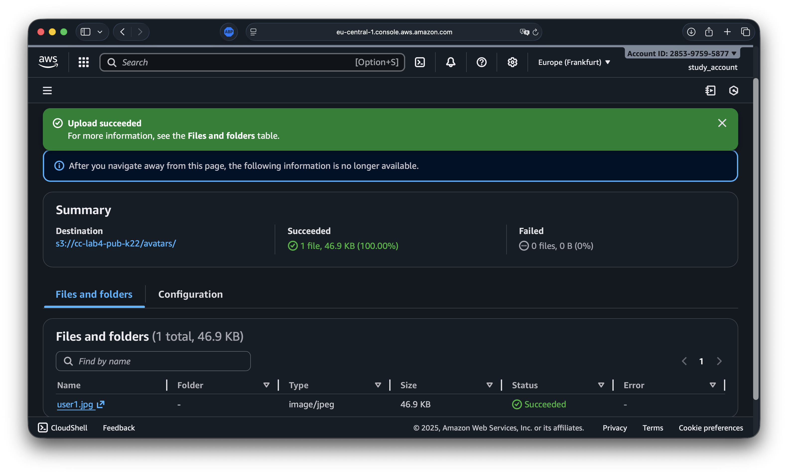

---

### Шаг 4. Загрузка через AWS CLI

```bash
# user2.jpg — публично
aws s3 cp s3-lab/public/avatars/user2.jpg \
  s3://cc-lab4-pub-k22/avatars/user2.jpg \
  --acl public-read

# logo.png — публично
aws s3 cp s3-lab/public/content/logo.png \
  s3://cc-lab4-pub-k22/content/logo.png \
  --acl public-read

# activity.csv — приватно в private-бакет
aws s3 cp s3-lab/private/logs/activity.csv \
  s3://cc-lab4-priv-k22/logs/activity.csv
```

> 

> **cp / mv / sync:**  
> cp — копирует; mv — копирует и удаляет исходник; sync — рекурсивно синхронизирует папки (удобно для деплоя статики).  
> --acl public-read — делает объект публично читаемым (только если Block Public Access отключён у бакета).

---

### Шаг 5. Проверка доступа по URL

- **Публичный объект:**  
  Открываю в браузере  
  `https://cc-lab4-pub-k22.s3.eu-central-1.amazonaws.com/avatars/user1.jpg`  
  — изображение открывается.

  > 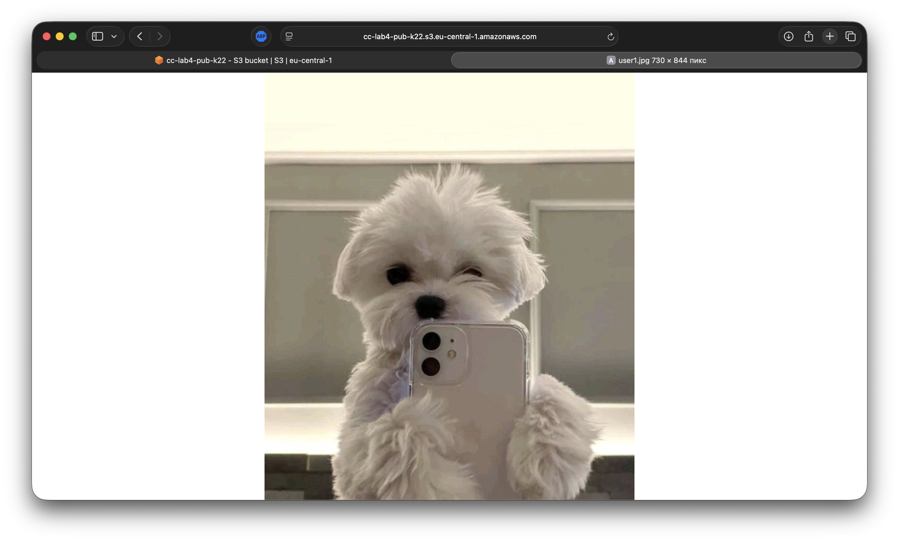

- **Приватный объект:**  
  Открываю  
  `https://cc-lab4-priv-k22.s3.eu-central-1.amazonaws.com/logs/activity.csv`  
  — AccessDenied (ожидаемо).

  > 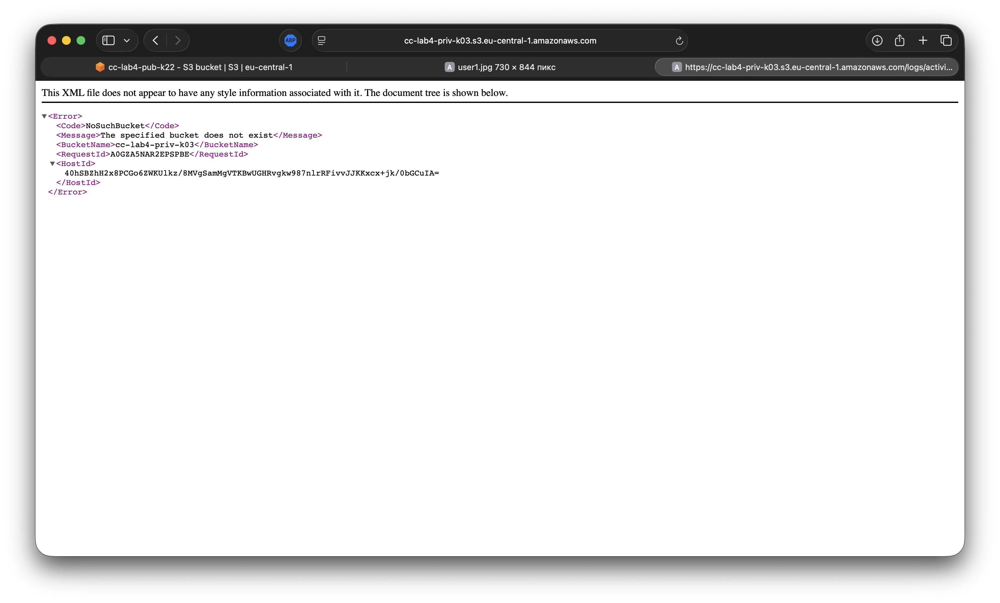

---

### Шаг 6. Включить Versioning (на обоих бакетах)

- Bucket → Properties → Bucket Versioning → Edit → Enable → Save.
- После этого перезалил `content/logo.png` (через CLI с --acl public-read) — появилась новая версия.

> 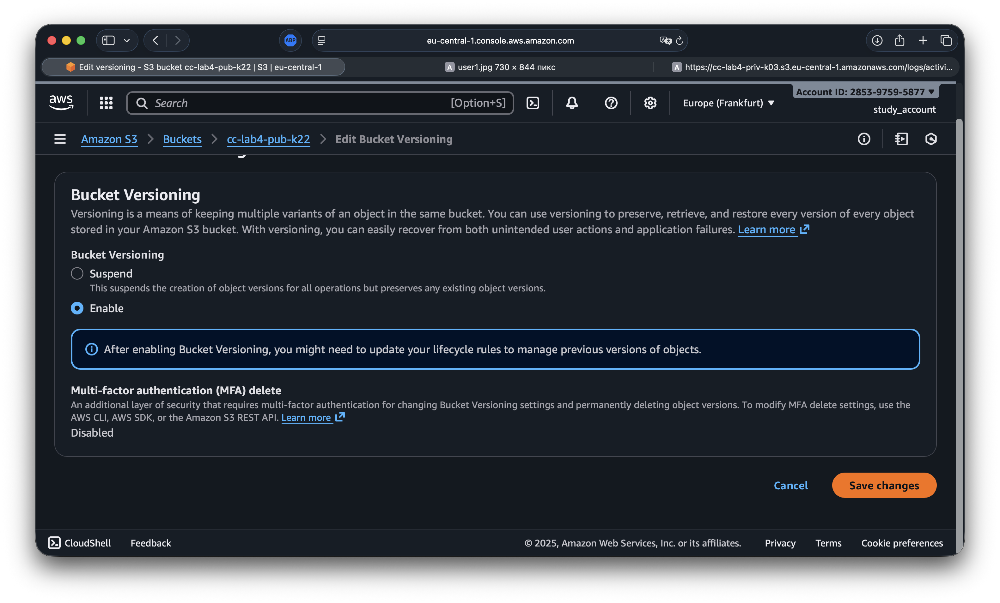  
> 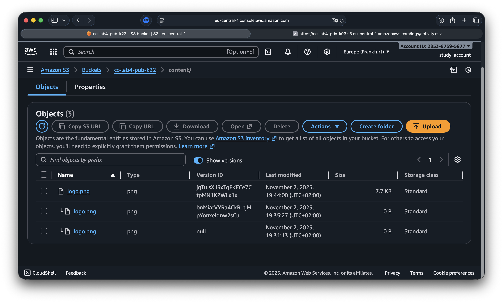

> **Если отключить Versioning после включения:**  
> Новые версии создаваться не будут, существующие версии останутся (видны как «non-current»/с Version ID). Удаление версий — вручную или Lifecycle.

---

### Шаг 7. Lifecycle для приватного бакета (архив логов)

- Открываю `cc-lab4-priv-k22` → Management → Lifecycle rules → Create rule
  - **Rule name:** logs-archive
  - **Scope:** Limit… → Prefix: logs/
  - **Actions:**
    - Transition → Move to Standard-IA after 30 days
    - Transition → Move to Glacier Deep Archive after 365 days
    - Expiration → Expire current versions after 1825 days (5 лет)
  - **Create rule**

> 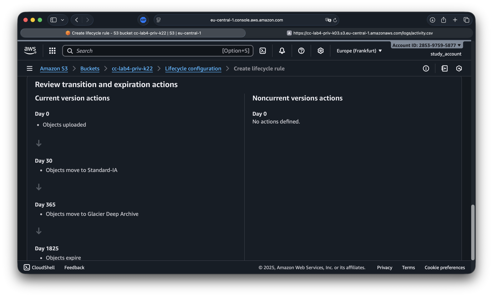

> **Storage Class:** тарифная «ступень» хранения с разной стоимостью и SLA. Чем «холоднее» класс, тем дешевле хранить и дороже/дольше доставать.

---

### Шаг 8. S3 Static Website Hosting (отдельный бакет)

#### 8.1 Создаю бакет под сайт

- **Name:** `cc-lab4-web-k22`
- **Region:** eu-central-1
- **Object Ownership:** ACLs enabled
- **Block Public Access:** снять галочку (и подтвердить предупреждение)
- **Create bucket**

> 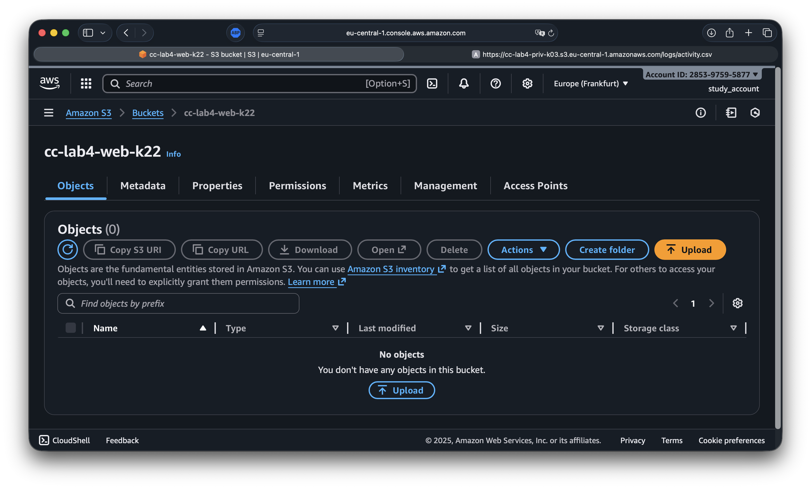

#### 8.2 Включаю Website Hosting

- `cc-lab4-web-k22` → Properties → Static website hosting → Edit → Enable
- **Hosting type:** Host a static website
- **Index document:** index.html → Save changes
- Копирую Endpoint (пример: http://cc-lab4-web-k22.s3-website.eu-central-1.amazonaws.com)

> 

#### 8.3 Заливаю индекс и проверяю

```bash
echo '<!doctype html><meta charset="utf-8"><h1>S3 website OK</h1>' > s3-lab/index.html

aws s3 cp s3-lab/index.html \
  s3://cc-lab4-web-k22/index.html \
  --acl public-read
```

Открываю Endpoint — сайт открывается.

> 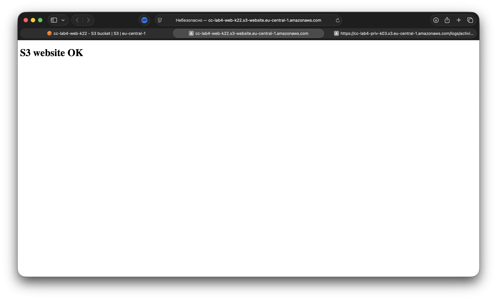

> В проде обычно добавляют CloudFront + HTTPS или используют AWS Amplify для удобного CI/CD.

---

## Чек-лист

| Действие                                                                                           | Статус |
| -------------------------------------------------------------------------------------------------- | :----: |
| Создан `cc-lab4-pub-k22` (ACLs enabled, Block Public Access OFF)                                   |   ✅   |
| Создан `cc-lab4-priv-k22` (ACLs enabled, Block Public Access ON)                                   |   ✅   |
| Загрузил `user1.jpg` через UI (с public-read)                                                      |   ✅   |
| Загрузил `user2.jpg`, `logo.png` через CLI (--acl public-read), `activity.csv` — в приватный бакет |   ✅   |
| Проверил: публичные URL открываются; приватный — AccessDenied                                      |   ✅   |
| Включил Versioning в обоих бакетах, получил несколько версий `logo.png`                            |   ✅   |
| Настроил Lifecycle для `logs/` в приватном бакете                                                  |   ✅   |
| Развернул Static Website Hosting в `cc-lab4-web-k22` и загрузил `index.html`                       |   ✅   |

---

## Контрольные вопросы — мои ответы

| №   | Вопрос                                                          | Ответ                                                                                                                                                                                             |
| --- | --------------------------------------------------------------- | ------------------------------------------------------------------------------------------------------------------------------------------------------------------------------------------------- |
| 1   | Чем отличается ACL от Object Ownership (Bucket owner enforced)? | ACLs enabled позволяет задавать доступ на уровне объекта (например, public-read). Bucket owner enforced отключает ACL и требует управлять доступом политиками (рекомендуемый прод-вариант).       |
| 2   | Что означает “Block all public access”?                         | Это глобальный «стоп-кран» публичности для бакета/аккаунта: даже при public-read объекты не будут доступны по ссылке. Включён в приватном бакете; снят в публичном и web-бакете.                  |
| 3   | Чем object key отличается от имени файла?                       | Ключ это «виртуальный путь» внутри бакета (`avatars/user1.jpg`). Имя локального файла может отличаться; ключ уникален внутри бакета.                                                              |
| 4   | Разница aws s3 cp \| mv \| sync и что делает --acl public-read? | cp — копия; mv — копия + удаление исходника; sync — рекурсивная синхронизация директорий. --acl public-read делает объект публично читаемым (если не блокируется настройкой Block Public Access). |
| 5   | Что произойдёт, если отключить Versioning после включения?      | Новые версии больше не создаются, но старые версии остаются (их видно по Version ID). Удалять — вручную или Lifecycle-правилами.                                                                  |
| 6   | Что такое Storage Classes и зачем они?                          | Классы хранения с разной стоимостью/доступностью (Standard, Standard-IA, One Zone-IA, Glacier, Glacier Deep Archive…). Нужны для оптимизации цены хранения по «возрасту» и частоте доступа.       |
| 7   | Bucket Key (в контексте SSE-KMS) — что это и когда включать?    | Способ сократить число обращений к KMS (и стоимость) при шифровании SSE-KMS. В этой работе шифрование не включал; в проде при SSE-KMS обычно включают Bucket Key.                                 |

---

## Структура репозитория

```
lab4_s3_storage/
├─ README.md # Этот отчёт
└─ screenshots/
   ├─ lab4_01_cli_region.png
   ├─ lab4_02_local_tree.png
   ├─ lab4_03_find_s3_region.png
   ├─ lab4_04_bucket_public.png
   ├─ lab4_05_bucket_private.png
   ├─ lab4_06_upload_user1_ui.png
   ├─ lab4_07_cli_uploads.png
   ├─ lab4_08_public_ok.png
   ├─ lab4_09_private_denied.png
   ├─ lab4_10_versioning_on.png
   ├─ lab4_11_logo_versions.png
   ├─ lab4_12_lifecycle_rule.png
   ├─ lab4_13_web_bucket.png
   ├─ lab4_14_static_hosting.png
   └─ lab4_15_website_ok.png
```

---

## Стоимость и уборка ресурсов

- **S3 тарифицирует хранение, операции и трафик.**
- Чтобы подмести: удалить объекты и/или бакеты (бакет удаляется только когда пуст).

```bash
aws s3 rm s3://cc-lab4-web-k22 --recursive
aws s3 rb s3://cc-lab4-web-k22
```

---

## Вывод

Я последовательно выполнил все шаги по работе с Amazon S3 в регионе eu-central-1:  
создал публичный и приватный бакеты с корректными параметрами публичности, загрузил файлы через консоль и CLI, проверил доступ по URL (публичный объект открывается, приватный — AccessDenied), включил Versioning, настроил Lifecycle для логов, развернул Static Website Hosting на отдельном бакете и подтвердил доступность сайта через S3 endpoint.

**По итогам работы закрепил понимание ключевых понятий S3:**  
ключ объекта vs имя файла, ACL vs Bucket owner enforced, роль Block all public access, Versioning/Storage Classes/Lifecycle, а также базовые практики безопасности и экономии в S3.
