# ☁️ Лабораторная работа №5

**Облачные базы данных в AWS (RDS MySQL, Read Replica, EC2, Terraform, простое веб-приложение)** — полный отчёт со скриншотами

---

## 📋 Студент

- **Имя и фамилия:** Савка Никита (Savca Nichita)
- **Группа:** I2302
- **Специализация:** DevOps
- **Рабочая станция:** macOS (Apple Silicon), VS Code, встроенный Терминал (zsh)
- **Среда выполнения:**
  - AWS Management Console (браузер)
  - AWS RDS (MySQL + Read Replica)
  - AWS EC2
  - AWS VPC (используется существующая VPC с публичными/приватными подсетями)
  - AWS Security Groups
  - Terraform (для автоматизации SG и EC2)
  - PHP + Apache на EC2 (для шага 6a)
- **Регион AWS:** EU (Frankfurt) eu-central-1
- **Формат сдачи:** README.md (Markdown) + папка screenshots/ со скриншотами
- **Дата выполнения:** ноябрь 2025

---

## 🎯 Цель и суть работы

**Цель лабораторной работы:**
Познакомиться с облачными базами данных в AWS — Amazon RDS (MySQL + Read Replica) и, опционально, Amazon DynamoDB, а также:

- Развернуть реляционную базу данных MySQL в Amazon RDS в приватных подсетях.
- Настроить Security Groups так, чтобы к базе данных можно было подключаться только с приложения в той же VPC.
- Создать Read Replica для разгрузки чтения и повышения отказоустойчивости.
- С EC2-инстанса (в публичной подсети) подключиться к RDS, создать две связанные таблицы (one-to-many), выполнить типичные CRUD-операции.
- Реализовать простое веб-приложение (вариант 6a) на PHP:
  - Все записи (INSERT/UPDATE/DELETE) — через MASTER endpoint.
  - Все чтения (SELECT) — через Read Replica endpoint.
- Для специализации DevOps — дополнительно:
  - Автоматизировать создание Security Groups и EC2-инстанса с помощью Terraform.
  - Описать инфраструктуру как код (IaC) и проконтролировать соответствие созданных ресурсов плану.

Дополнительно в теоретической части рассматривается DynamoDB, отличие от RDS и варианты совместного использования.

---

## 🧠 Общая архитектура (концепция)

**Логика архитектуры:**

- **VPC** (project-vpc)
  Уже существует/создана заранее: в ней есть минимум две приватные и две публичные подсети в разных AZ.
- **Приватные подсети**
  В них развёрнута база данных:
  - Amazon RDS MySQL — основной экземпляр: project-rds-mysql-prod
  - Read Replica — project-rds-mysql-read-replica
- **Публичная подсеть**
  В ней находится:
  - EC2-инстанс (веб-сервер + PHP), который:
    - Имеет доступ к Интернету (через IGW/NAT, в зависимости от архитектуры VPC).
    - Имеет доступ к RDS по порту 3306 согласно Security Groups.
- **Security Groups**
  - web-security-group — для EC2:
    - Inbound: HTTP (80) с любого источника, SSH (22) с моего IP (или 0.0.0.0/0 для учебных целей).
    - Outbound: разрешён MySQL (3306) к db-mysql-security-group.
  - db-mysql-security-group — для RDS:
    - Inbound: MySQL (3306) только от web-security-group.
- **Приложение (шаг 6a):**
  - Запущено на EC2 (Apache + PHP).
  - Master RDS endpoint используется для всех операций записи: INSERT, UPDATE, DELETE.
  - Read Replica endpoint используется для всех операций чтения: SELECT.
  - Две таблицы:
    - categories (id, name)
    - todos (id, title, status, category_id → FK на categories.id)
- **Terraform (для DevOps части):**
  - Описывает:
    - Security Group web-security-group.
    - Security Group db-mysql-security-group.
    - EC2-инстанс для приложения.
  - Использует существующую VPC и подсети (их идентификаторы передаются через переменные).

Сюда вставляется схема архитектуры (VPC + RDS + EC2 + SG + master/replica)

> 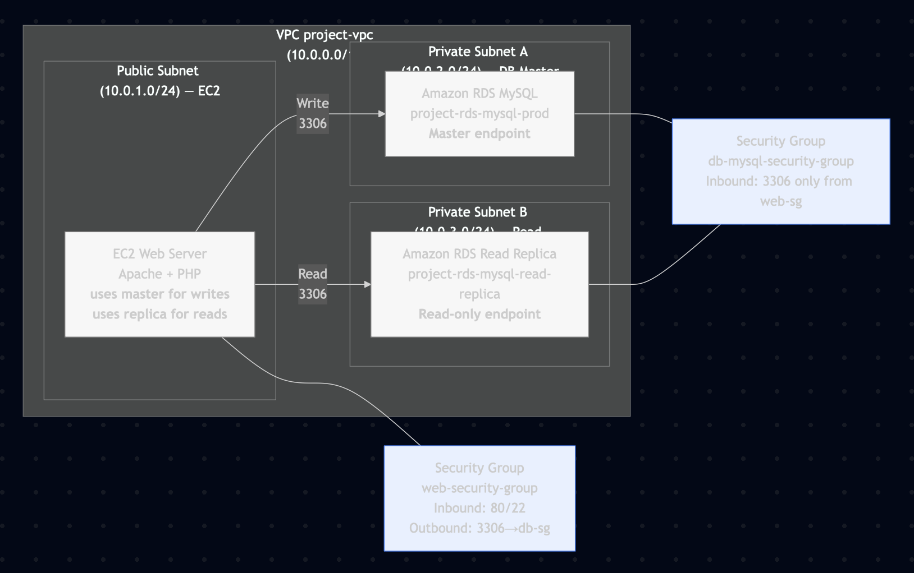

---

## 🧪 Практическая часть (пошагово, как делал я)

Именование скринов: lab5_XX\_\_кратко.png.
Ниже для каждого шага указываю где делать скрин и что должно быть видно.

---

### Шаг 1. Подготовка среды: регион, VPC, Security Groups

#### 1.1. Создание новой VPC через мастер

Я создал новую VPC с помощью мастера в AWS Console:

1. Вошёл в AWS Management Console под своим IAM-пользователем.
2. В правом верхнем углу выбрал регион EU (Frankfurt) eu-central-1.
3. Через поиск открыл сервис VPC.
4. В левом меню выбрал **Your VPCs → Create VPC**.
5. На вкладке **VPC and more** заполнил параметры:
   - Name tag auto-generation: `project-vpc`
   - IPv4 CIDR block: `10.50.0.0/16`
   - Number of Availability Zones: `2`
   - Number of public subnets: `2`
   - Number of private subnets: `2`
   - NAT gateways: `In 1 AZ`
   - Остальные параметры оставил по умолчанию.
6. Нажал **Create VPC**.

В результате мастер автоматически создал:

- VPC с именем `project-vpc`
- 4 подсети (2 публичные, 2 приватные)
- Internet Gateway (IGW)
- NAT Gateway
- Route tables и все необходимые связи

> 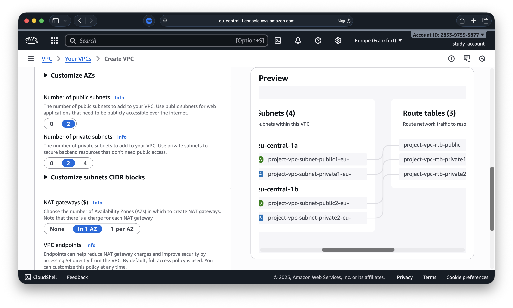 > 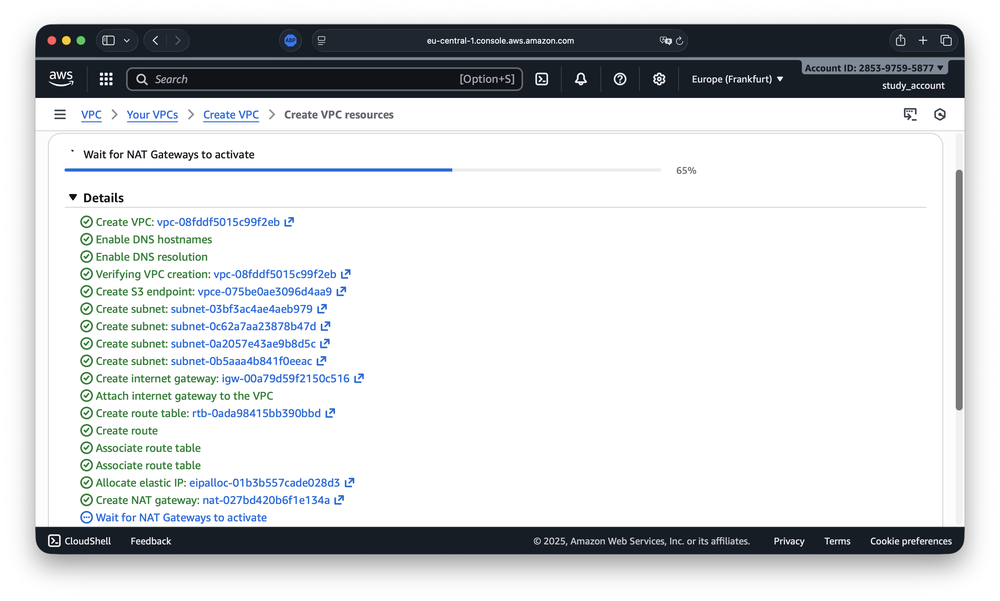

**Имена ресурсов:**

- VPC: `project-vpc`
- Подсети: например, `project-vpc-public-subnet-1`, `project-vpc-private-subnet-1` и т.д.

> 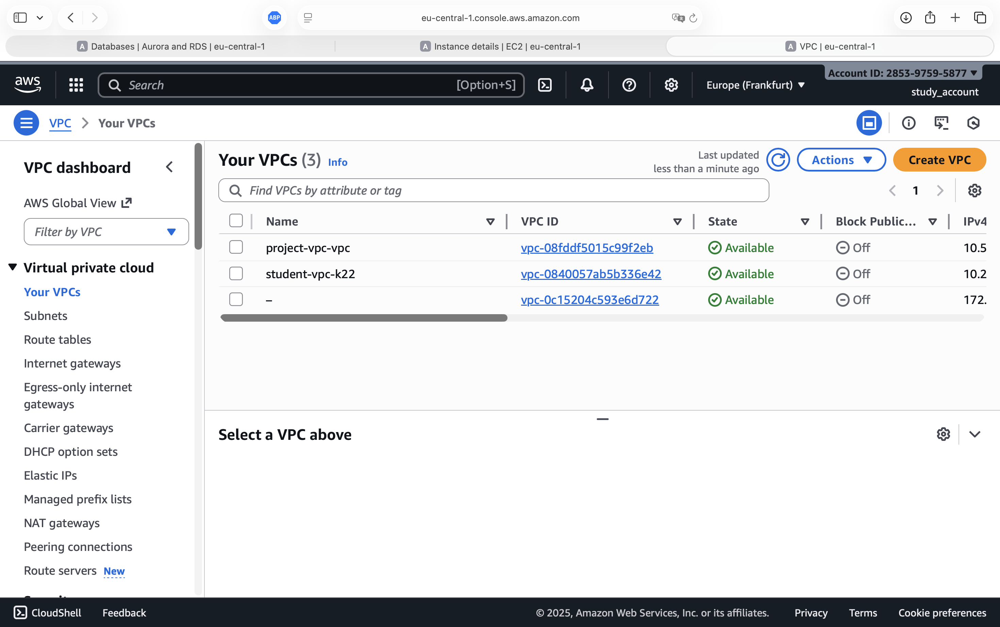

---

#### 1.2. Структура VPC (публичные и приватные подсети)

По заданию требуется: 2 публичные + 2 приватные подсети в разных AZ. Я использовал:

- **VPC:** project-vpc
- **Пример:**
  - Public Subnets:
    - project-public-subnet-a (eu-central-1a)
    - project-public-subnet-b (eu-central-1b)
  - Private Subnets:
    - project-private-subnet-a (eu-central-1a)
    - project-private-subnet-b (eu-central-1b)

> 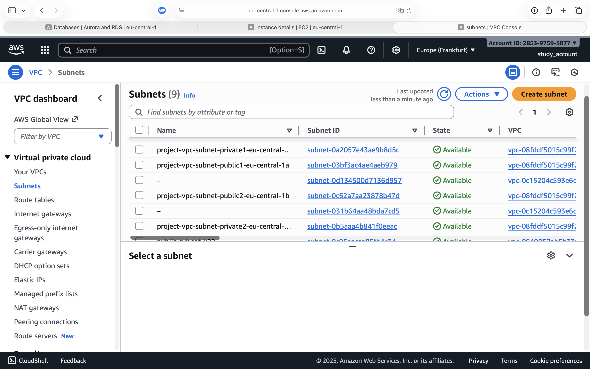

---

#### 1.3. Security Group для приложения: web-security-group

1. В AWS Console открыл сервис EC2 → слева Security Groups → Create security group.
2. Настроил:
   - Security group name: web-security-group
   - Description: Security group for web application EC2
   - VPC: project-vpc
3. В разделе Inbound rules добавил:
   - Rule 1:
     - Type: HTTP
     - Port: 80
     - Source: 0.0.0.0/0 (для учебных целей)
   - Rule 2:
     - Type: SSH
     - Port: 22
     - Source: My IP (или 0.0.0.0/0 в учебной среде)
4. В Outbound rules оставил правило Allow All (позже Terraform добавил явный egress для 3306 к db-SG).

> 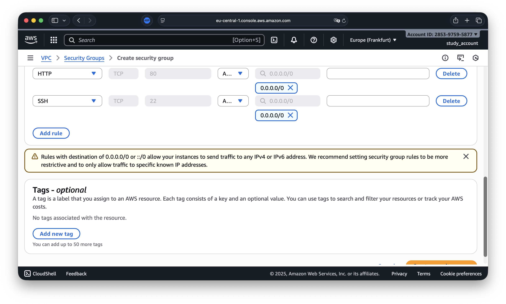

---

#### 1.4. Security Group для базы данных: db-mysql-security-group

1. Там же, в Security Groups → Create security group.
2. Настройки:
   - Security group name: db-mysql-security-group
   - Description: Security group for RDS MySQL
   - VPC: project-vpc
3. В Inbound rules:
   - Type: MySQL/Aurora
   - Port: 3306
   - Source: web-security-group (выбрал по имени из списка security groups)
4. Outbound — по умолчанию Allow All.

> 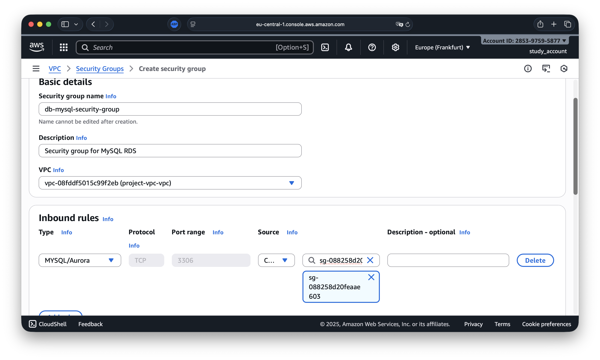

---

#### 1.5. Исходящий трафик (3306) от web-security-group

По условию, web-security-group должен уметь инициировать соединения к БД (egress на 3306 к db-SG).

Я убедился, что:

- Либо стоит Outbound: All traffic → 0.0.0.0/0 (что уже даёт исход к RDS).
- Либо (более строго) добавил явное правило:
  - Type: MySQL/Aurora
  - Port: 3306
  - Destination: db-mysql-security-group

> 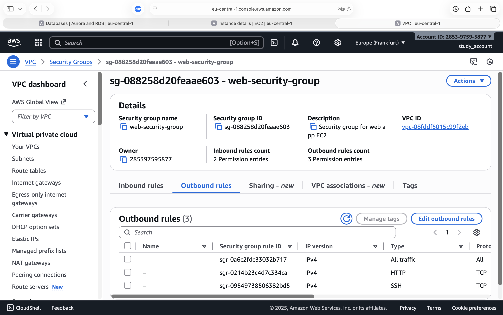

---

### Шаг 2. Развёртывание Amazon RDS (MySQL)

#### 2.1. Создание Subnet Group для RDS: project-rds-subnet-group

1. Открыл сервис RDS через поиск (RDS) → Subnet groups → Create DB subnet group.
2. Заполнил:
   - Name: project-rds-subnet-group
   - Description: Subnet group for project RDS MySQL
   - VPC: project-vpc
3. В секции Add subnets:
   - Выбрал 2 приватные подсети в разных AZ (например, project-private-subnet-a и project-private-subnet-b в eu-central-1a и eu-central-1b).
   - Нажал Create.

> 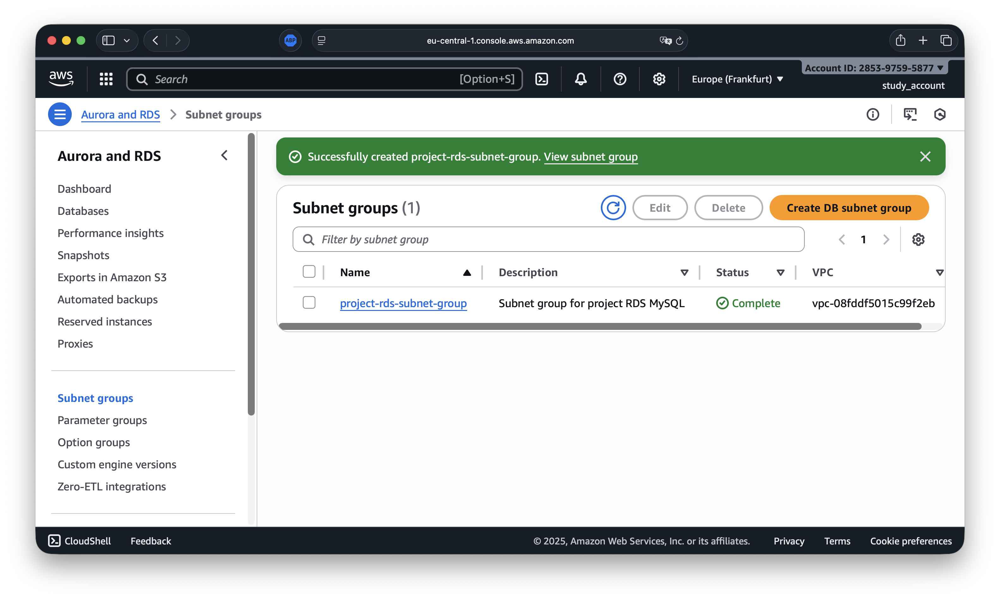

**Что такое Subnet Group и зачем она нужна?**
Subnet Group — это логическая группа подсетей внутри одной VPC, которую RDS использует для размещения своих инстансов. Для отказоустойчивости обычно включают несколько подсетей в разных AZ. Без Subnet Group RDS не знает, в каких подсетях ему разрешено поднимать базы.

---

#### 2.2. Создание основного экземпляра RDS: project-rds-mysql-prod

1. В RDS → Databases → Create database.
2. В блоке Choose a database creation method:
   - Выбрал Standard create.
3. Engine options:
   - Engine type: MySQL
   - Version: MySQL 8.0.42 (или последняя доступная)
4. Templates:
   - Free tier (учебная среда).
5. Settings:
   - DB instance identifier: project-rds-mysql-prod
   - Master username: admin
   - Master password: задал сложный пароль (записал его, использовал далее).
6. DB instance class:
   - db.t3.micro (Burstable, подходит для free tier).
7. Storage:
   - Storage type: General Purpose SSD (gp3)
   - Allocated storage: 20 GB
   - Enable storage autoscaling: ✅
   - Maximum storage threshold: 100 GB
8. Connectivity:
   - Don’t connect to an EC2 compute resource.
   - VPC: project-vpc
   - DB Subnet Group: project-rds-subnet-group
   - Public access: No
   - VPC security groups: выбрал db-mysql-security-group
   - AZ: No preference
9. Additional configuration:
   - Initial database name: project_db
   - Backup: Enable automated backups ✅ (нужно для Read Replica)
   - Encryption: Disabled (учебная работа)
   - Maintenance: Auto minor version upgrade — выключено (для предсказуемости).

После этого нажал Create database и ждал, пока статус сменился на Available.

> 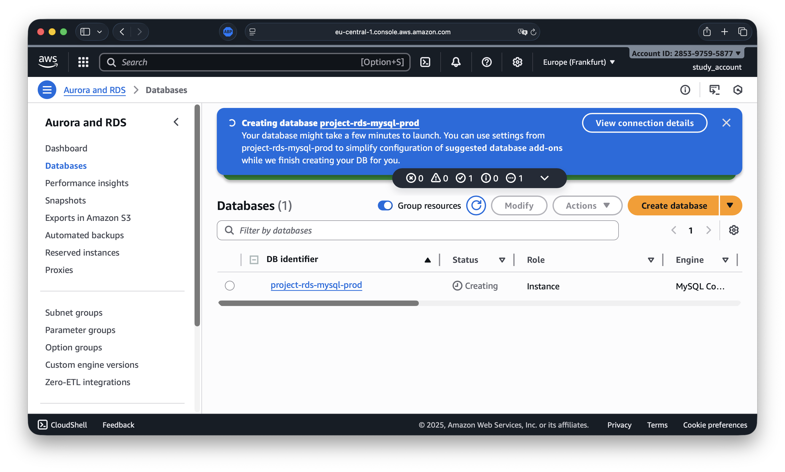

Далее на вкладке Connectivity & security скопировал Endpoint вида:

project-rds-mysql-prod.xxxxxxxx.eu-central-1.rds.amazonaws.com

> 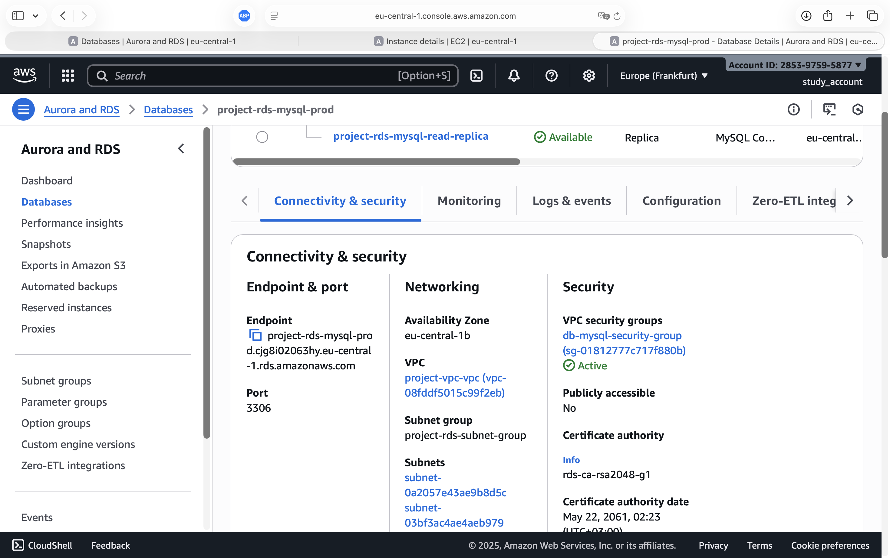

---

### Шаг 3. EC2-инстанс для подключения к RDS

#### 3.1. Создание EC2 в публичной подсети

1. Открыл EC2 → Instances → Launch instances.
2. Параметры:
   - Name: project-ec2-web
   - AMI: Amazon Linux 2023 / Amazon Linux 2 (HVM, SSD)
   - Instance type: t3.micro
   - Key pair: project-ec2-web (ключ скачан заранее)
   - Network settings:
     - VPC: project-vpc
     - Subnet: одна из публичных (например, project-public-subnet-a)
     - Auto-assign Public IP: Enable
     - Security Group: web-security-group
3. User data:

```bash
#!/bin/bash
dnf update -y
dnf install -y mariadb105 httpd php php-mysqlnd
systemctl enable httpd
systemctl start httpd
```

> 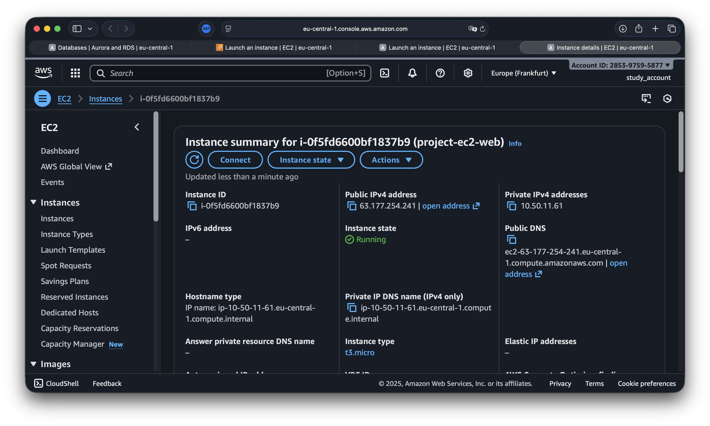

---

#### 3.2. Подключение по SSH к EC2 и установка веб-стека (дополнительно)

Локально на macOS (терминал):

```bash
chmod 400 project-ec2-web.pem
ssh -i project-ec2-web.pem ec2-user@
```

> 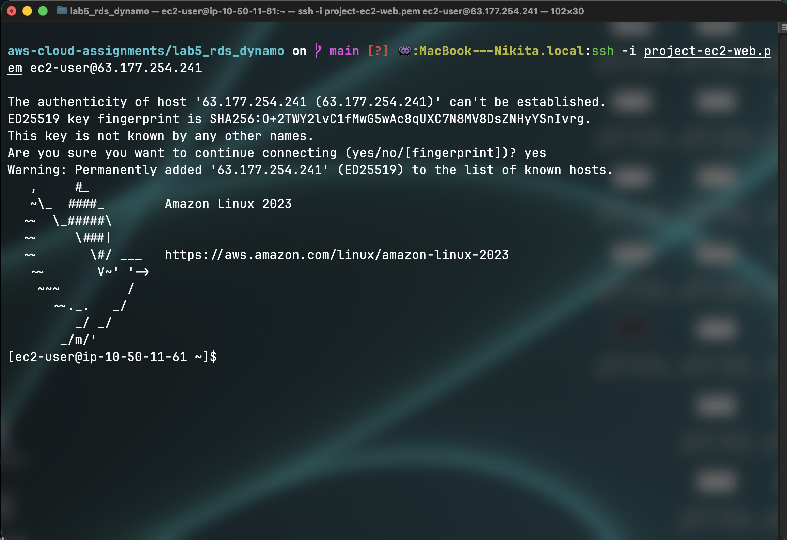

---

### Шаг 4. Подключение к RDS и создание схемы БД

#### 4.1. Подключение к RDS с EC2 (mysql клиент)

На EC2:

```bash
mysql -h <RDS_ENDPOINT> -u admin -p
# <RDS_ENDPOINT> — это endpoint `project-rds-mysql-prod`
```

После ввода пароля — попал в mysql-приглашение:

```sql
mysql> SHOW DATABASES;
mysql> USE project_db;
```

> 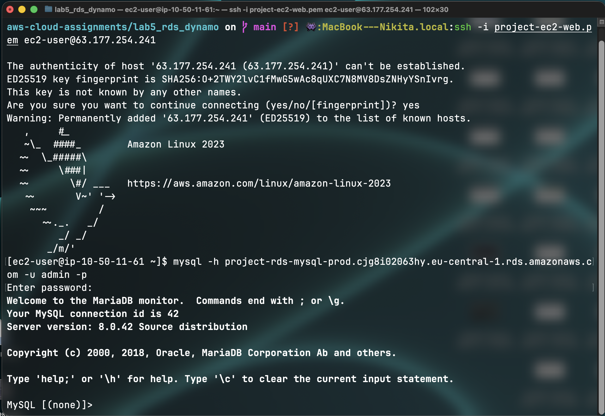

---

#### 4.2. Создание таблиц categories и todos (связь one-to-many)

Внутри mysql:

```sql
USE project_db;

-- Таблица категорий
CREATE TABLE categories (
id INT AUTO_INCREMENT PRIMARY KEY,
name VARCHAR(255) NOT NULL
);

-- Таблица задач (todos) с FK на categories.id
CREATE TABLE todos (
id INT AUTO_INCREMENT PRIMARY KEY,
title VARCHAR(255) NOT NULL,
status VARCHAR(50) NOT NULL DEFAULT 'pending',
category_id INT NOT NULL,
CONSTRAINT fk_todos_category
FOREIGN KEY (category_id) REFERENCES categories(id)
ON DELETE CASCADE
ON UPDATE CASCADE
);
```

> 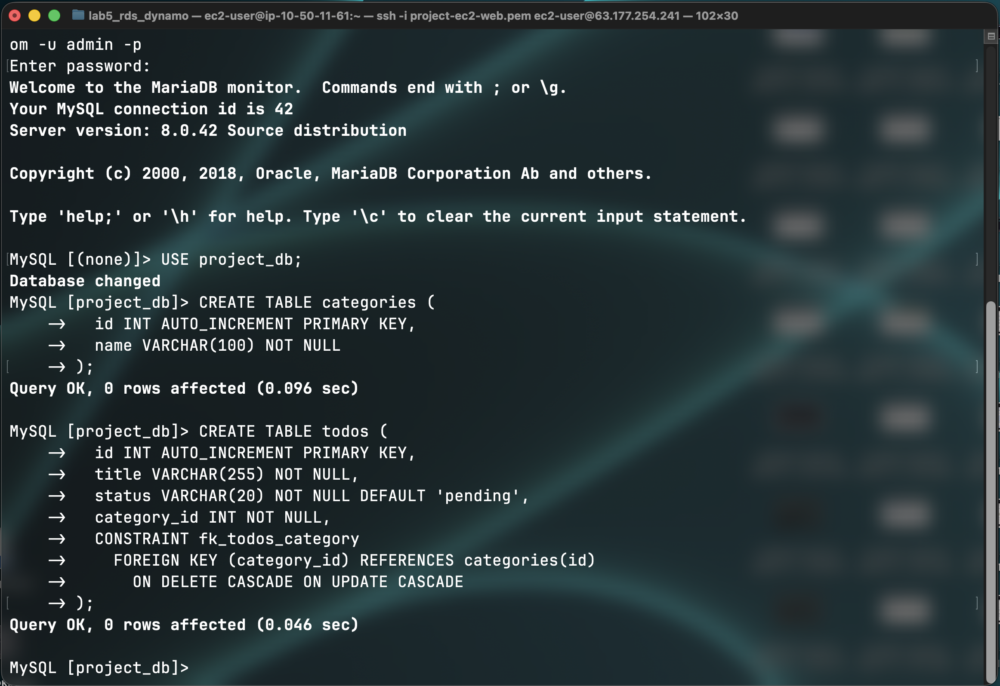

---

#### 4.3. Вставка данных и тестовые SELECT + JOIN

```sql
-- Категории
INSERT INTO categories (name)
VALUES
('Work'),
('Study'),
('Personal');

-- Задачи
INSERT INTO todos (title, status, category_id)
VALUES
('Finish AWS Lab 5', 'in_progress', 2),
('Buy groceries', 'pending', 3),
('Deploy new release', 'pending', 1);

-- Простая выборка
SELECT * FROM categories;
SELECT * FROM todos;

-- JOIN выборка
SELECT
t.id,
t.title,
t.status,
c.name AS category_name
FROM todos t
JOIN categories c ON t.category_id = c.id
ORDER BY t.id;
```

> 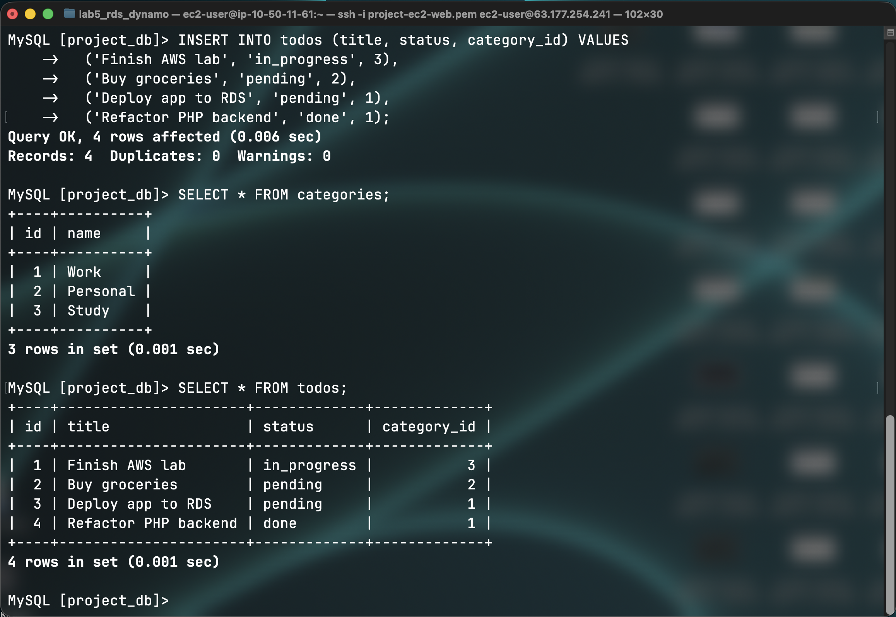

---

### Шаг 5. Создание Read Replica и анализ поведения

#### 5.1. Создание Read Replica

1. В RDS → Databases выбрал project-rds-mysql-prod.
2. Нажал Actions → Create read replica.
3. Параметры:
   - DB instance identifier: project-rds-mysql-read-replica
   - DB instance class: db.t3.micro
   - Storage: gp3
   - Monitoring: Enhanced monitoring — отключено
   - Public access: No
   - VPC security groups: db-mysql-security-group
4. Нажал Create read replica и дождался статуса Available.

> 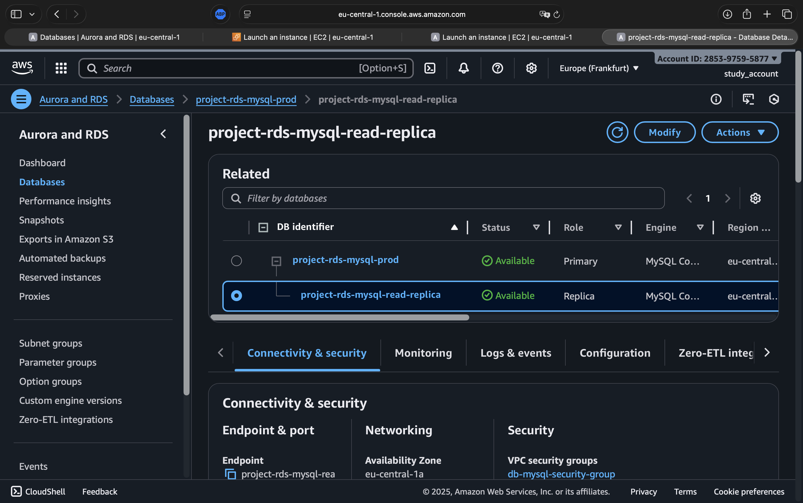

На вкладке Connectivity & security скопировал endpoint реплики.

---

#### 5.2. Подключение к Read Replica и проверка чтения

С EC2:

```bash
mysql -h <REPLICA_ENDPOINT> -u admin -p
USE project_db;

SELECT
t.id,
t.title,
t.status,
c.name AS category_name
FROM todos t
JOIN categories c ON t.category_id = c.id
ORDER BY t.id;
```

Я увидел те же данные, что и на master.

**Почему?**
Read Replica асинхронно реплицирует данные с master RDS экземпляра. Все изменения, внесённые в master (project-rds-mysql-prod), спустя короткое время становятся видны на реплике.

> 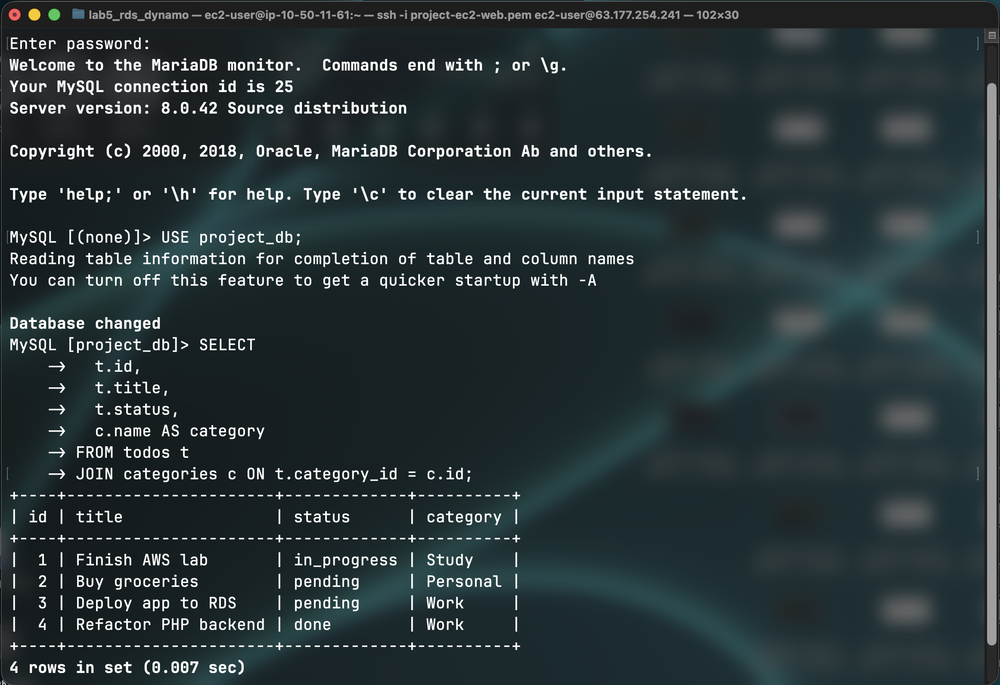

---

#### 5.3. Попытка записи на Read Replica

Я намеренно попробовал выполнить INSERT на Read Replica:

```sql
INSERT INTO categories (name) VALUES ('ShouldFailOnReplica');
```

В ответ получил ошибку, что экземпляр доступен только для чтения (read-only).

**Почему запись не проходит на Read Replica?**
Read Replica предназначена только для чтения. Запись возможна только на master-инстансе. Это защищает консистентность и не позволяет расщепить поток записи.

> 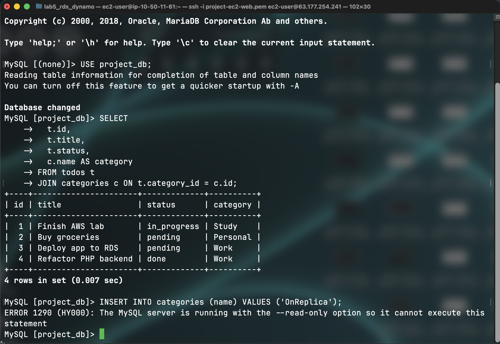

---

#### 5.4. Проверка репликации после изменения на master

1. Подключился снова к master (project-rds-mysql-prod) и добавил новую задачу:

```sql
USE project_db;
INSERT INTO todos (title, status, category_id)
VALUES ('Task visible via replica', 'pending', 1);
```

2. Через некоторое время (обычно несколько секунд) снова подключился к Read Replica и сделал SELECT:

```sql
SELECT
t.id,
t.title,
t.status,
c.name AS category_name
FROM todos t
JOIN categories c ON t.category_id = c.id
ORDER BY t.id DESC
LIMIT 5;
```

3. В результате новая запись стала видна на реплике.

**Почему новая запись появилась?**
Потому что Read Replica асинхронно реплицирует все изменения, произведённые на master-инстансе. Это позволяет масштабировать операции чтения, не нагружая мастер.

> 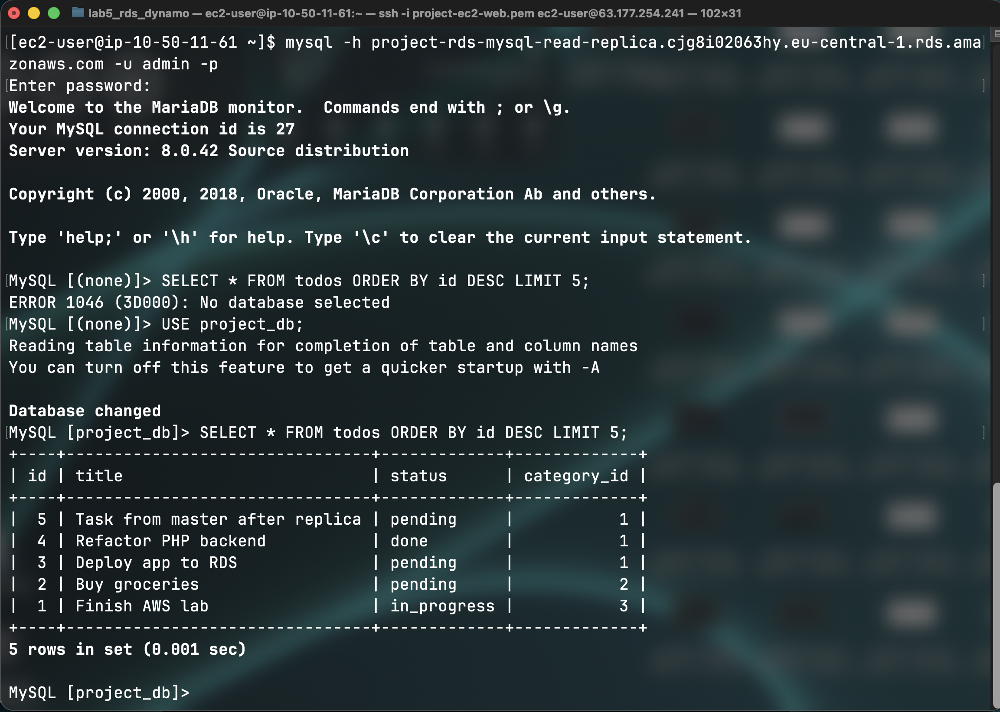

---

### Шаг 6a. Веб-приложение на PHP (Master → write, Replica → read)

В этом шаге я развернул простое PHP-приложение на EC2, которое:

- Для всех INSERT/UPDATE/DELETE подключается к master RDS endpoint.
- Для всех SELECT подключается к Read Replica endpoint.

#### 6.1. Структура приложения

Я разместил приложение в каталоге:

/var/www/html/lab5_app

**Структура:**

```
lab5_app/
├── config.php # Конфиг с параметрами master/replica
├── db.php # Подключения и функции работы с БД
└── index.php # Основная страница (формы + таблица задач)
```

---

#### 6.2. config.php — параметры master и replica

Файл: /var/www/html/lab5_app/config.php

```php
<?php
// config.php

return [
    'master' => [
        'host'   => 'project-rds-mysql-prod.xxxxxxxx.eu-central-1.rds.amazonaws.com', // endpoint master
        'dbname' => 'project_db',
        'user'   => 'admin',
        'pass'   => 'StrongPassword123!', // здесь я указал свой реальный пароль
    ],
    'replica' => [
        'host'   => 'project-rds-mysql-read-replica.xxxxxxxx.eu-central-1.rds.amazonaws.com', // endpoint replica
        'dbname' => 'project_db',
        'user'   => 'admin',
        'pass'   => 'StrongPassword123!',
    ],
];
```

> 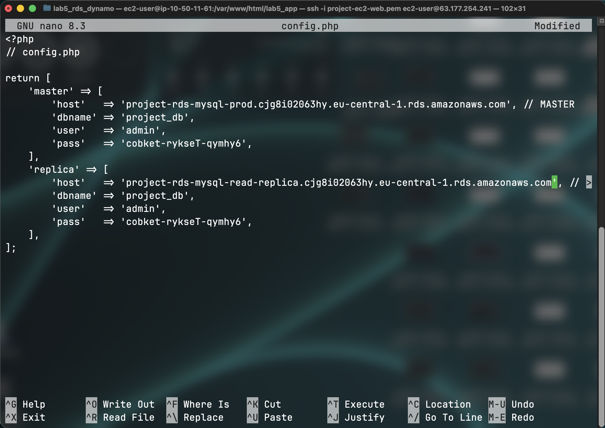

---

#### 6.3. db.php — обёртка вокруг PDO и CRUD-функции

Файл: /var/www/html/lab5_app/db.php

```php
<?php
// db.php

$config = require __DIR__ . '/config.php';

/**
 * Подключение к MASTER (для INSERT/UPDATE/DELETE).
 */
function get_master_pdo(): PDO
{
    static $pdo = null;

    if ($pdo === null) {
        $cfg = $GLOBALS['config']['master'];
        $dsn = sprintf('mysql:host=%s;dbname=%s;charset=utf8mb4', $cfg['host'], $cfg['dbname']);

        $pdo = new PDO($dsn, $cfg['user'], $cfg['pass'], [
            PDO::ATTR_ERRMODE            => PDO::ERRMODE_EXCEPTION,
            PDO::ATTR_DEFAULT_FETCH_MODE => PDO::FETCH_ASSOC,
        ]);
    }

    return $pdo;
}

/**
 * Подключение к REPLICA (для SELECT).
 */
function get_replica_pdo(): PDO
{
    static $pdo = null;

    if ($pdo === null) {
        $cfg = $GLOBALS['config']['replica'];
        $dsn = sprintf('mysql:host=%s;dbname=%s;charset=utf8mb4', $cfg['host'], $cfg['dbname']);

        $pdo = new PDO($dsn, $cfg['user'], $cfg['pass'], [
            PDO::ATTR_ERRMODE            => PDO::ERRMODE_EXCEPTION,
            PDO::ATTR_DEFAULT_FETCH_MODE => PDO::FETCH_ASSOC,
        ]);
    }

    return $pdo;
}

/**
 * Загрузить все категории (SELECT → replica).
 */
function load_categories(): array
{
    $pdo = get_replica_pdo();
    $stmt = $pdo->query('SELECT id, name FROM categories ORDER BY id');
    return $stmt->fetchAll();
}

/**
 * Загрузить все задачи с названием категории (SELECT → replica).
 */
function load_todos(): array
{
    $pdo = get_replica_pdo();
    $sql = <<<SQL
SELECT
    t.id,
    t.title,
    t.status,
    t.category_id,
    c.name AS category_name
FROM todos t
JOIN categories c ON t.category_id = c.id
ORDER BY t.id;
SQL;

    $stmt = $pdo->query($sql);
    return $stmt->fetchAll();
}

/**
 * Создать задачу (INSERT → master).
 */
function create_todo(string $title, string $status, int $category_id): void
{
    $pdo = get_master_pdo();
    $sql = 'INSERT INTO todos (title, status, category_id) VALUES (:title, :status, :category_id)';
    $stmt = $pdo->prepare($sql);
    $stmt->execute([
        ':title'       => $title,
        ':status'      => $status,
        ':category_id' => $category_id,
    ]);
}

/**
 * Обновить статус задачи (UPDATE → master).
 */
function update_todo_status(int $id, string $status): void
{
    $pdo = get_master_pdo();
    $sql = 'UPDATE todos SET status = :status WHERE id = :id';
    $stmt = $pdo->prepare($sql);
    $stmt->execute([
        ':status' => $status,
        ':id'     => $id,
    ]);
}

/**
 * Удалить задачу (DELETE → master).
 */
function delete_todo(int $id): void
{
    $pdo = get_master_pdo();
    $sql = 'DELETE FROM todos WHERE id = :id';
    $stmt = $pdo->prepare($sql);
    $stmt->execute([':id' => $id]);
}
```

---

#### 6.4. index.php — интерфейс приложения (формы + списки)

Файл: /var/www/html/lab5_app/index.php

```php
<?php
// index.php

$config = require __DIR__ . '/config.php';
require __DIR__ . '/db.php';

/**
 * Простейший помощник для редиректа на главную.
 */
function redirect_home(): void
{
    header('Location: /lab5_app/index.php');
    exit;
}

// Обработка действий (write → MASTER)
if ($_SERVER['REQUEST_METHOD'] === 'POST') {
    // Создание задачи
    $title       = trim($_POST['title'] ?? '');
    $status      = $_POST['status'] ?? 'pending';
    $category_id = (int)($_POST['category_id'] ?? 0);

    if ($title !== '' && $category_id > 0) {
        create_todo($title, $status, $category_id);
    }

    redirect_home();
}

if ($_SERVER['REQUEST_METHOD'] === 'GET' && isset($_GET['action'])) {
    $action = $_GET['action'];
    $id     = isset($_GET['id']) ? (int)$_GET['id'] : 0;

    if ($id > 0) {
        if ($action === 'delete') {
            delete_todo($id);
        } elseif ($action === 'mark_done') {
            update_todo_status($id, 'done');
        } elseif ($action === 'mark_pending') {
            update_todo_status($id, 'pending');
        }
    }

    redirect_home();
}

// READ → реплика
$categories = load_categories();
$todos      = load_todos();
?>
<!DOCTYPE html>
<html lang="en">
<head>
    <meta charset="UTF-8">
    <title>Lab5 RDS App (Master/Replica)</title>
    <style>
        body {
            font-family: system-ui, -apple-system, BlinkMacSystemFont, "Segoe UI", sans-serif;
            margin: 40px auto;
            max-width: 900px;
        }
        h1, h2 {
            margin-bottom: 0.4rem;
        }
        .env-info {
            font-size: 0.9rem;
            color: #555;
            margin-bottom: 1.2rem;
            padding: 0.6rem 0.8rem;
            border-radius: 6px;
            background: #f3f4f6;
        }
        form {
            margin: 1rem 0;
            padding: 1rem;
            border-radius: 8px;
            background: #f9fafb;
            border: 1px solid #e5e7eb;
        }
        label {
            display: block;
            margin-bottom: 0.4rem;
            font-weight: 500;
        }
        input[type="text"],
        select {
            width: 100%;
            padding: 0.4rem 0.5rem;
            margin-bottom: 0.8rem;
            border-radius: 6px;
            border: 1px solid #d1d5db;
        }
        button {
            padding: 0.4rem 0.8rem;
            border-radius: 9999px;
            border: none;
            cursor: pointer;
            font-size: 0.9rem;
        }
        button.primary {
            background: #2563eb;
            color: white;
        }
        button.danger {
            background: #dc2626;
            color: white;
        }
        button.secondary {
            background: #e5e7eb;
        }
        table {
            width: 100%;
            border-collapse: collapse;
            margin-top: 1rem;
        }
        th, td {
            padding: 0.5rem 0.6rem;
            border-bottom: 1px solid #e5e7eb;
            font-size: 0.9rem;
        }
        th {
            text-align: left;
            background: #f3f4f6;
        }
        .status-pill {
            display: inline-block;
            padding: 0.1rem 0.5rem;
            border-radius: 9999px;
            font-size: 0.8rem;
        }
        .status-pending {
            background: #fef3c7;
            color: #92400e;
        }
        .status-done {
            background: #dcfce7;
            color: #166534;
        }
        .actions form {
            display: inline-block;
        }
    </style>
</head>
<body>
    <h1>Lab 5: RDS Master / Read Replica Demo</h1>
    <p class="env-info">
        <strong>Reads (SELECT)</strong> выполняются через <strong>Read Replica</strong>.<br>
        <strong>Writes (INSERT/UPDATE/DELETE)</strong> выполняются через <strong>Master</strong>.<br>
        Master host: <code><?= htmlspecialchars($config['master']['host']) ?></code><br>
        Replica host: <code><?= htmlspecialchars($config['replica']['host']) ?></code>
    </p>

    <h2>Создать новую задачу</h2>
    <form method="post">
        <label for="title">Заголовок задачи</label>
        <input type="text" id="title" name="title" placeholder="Например, Finish AWS Lab 5" required>

        <label for="status">Статус</label>
        <select id="status" name="status">
            <option value="pending">pending</option>
            <option value="in_progress">in_progress</option>
            <option value="done">done</option>
        </select>

        <label for="category_id">Категория</label>
        <select id="category_id" name="category_id" required>
            <option value="">-- выберите категорию --</option>
            <?php foreach ($categories as $cat): ?>
                <option value="<?= (int)$cat['id'] ?>">
                    <?= htmlspecialchars($cat['id'] . ' — ' . $cat['name']) ?>
                </option>
            <?php endforeach; ?>
        </select>

        <button class="primary" type="submit">Создать задачу (MASTER)</button>
    </form>

    <h2>Список задач (читается с REPLICA)</h2>

    <?php if (empty($todos)): ?>
        <p>Задач пока нет.</p>
    <?php else: ?>
        <table>
            <thead>
                <tr>
                    <th>#</th>
                    <th>Заголовок</th>
                    <th>Категория</th>
                    <th>Статус</th>
                    <th>Действия</th>
                </tr>
            </thead>
            <tbody>
                <?php foreach ($todos as $todo): ?>
                    <tr>
                        <td><?= (int)$todo['id'] ?></td>
                        <td><?= htmlspecialchars($todo['title']) ?></td>
                        <td><?= htmlspecialchars($todo['category_name']) ?></td>
                        <td>
                            <?php
                            $status = $todo['status'];
                            $statusClass = $status === 'done' ? 'status-done' : 'status-pending';
                            ?>
                            <span class="status-pill <?= $statusClass ?>">
                                <?= htmlspecialchars($status) ?>
                            </span>
                        </td>
                        <td class="actions">
                            <?php if ($todo['status'] !== 'done'): ?>
                                <a href="?action=mark_done&id=<?= (int)$todo['id'] ?>">
                                    <button type="button" class="secondary">Mark done</button>
                                </a>
                            <?php else: ?>
                                <a href="?action=mark_pending&id=<?= (int)$todo['id'] ?>">
                                    <button type="button" class="secondary">Mark pending</button>
                                </a>
                            <?php endif; ?>

                            <a href="?action=delete&id=<?= (int)$todo['id'] ?>"
                               onclick="return confirm('Удалить задачу #<?= (int)$todo['id'] ?>?');">
                                <button type="button" class="danger">Delete</button>
                            </a>
                        </td>
                    </tr>
                <?php endforeach; ?>
            </tbody>
        </table>
    <?php endif; ?>

</body>
</html>
```

> 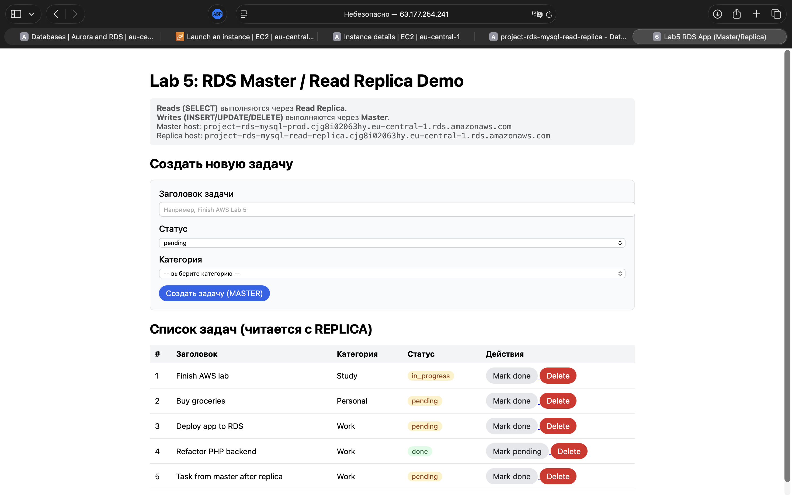

---

#### 6.5. Проверка работы приложения

1. В браузере открыл:

http://<EC2_PUBLIC_IP>/lab5_app/index.php

2. Создал несколько задач, указав разные категории и статусы.
3. Проверил, что:
   - При создании задач база данных на master пополняется (INSERT через master).
   - Список задач всегда читается с Read Replica (SELECT через replica).

> 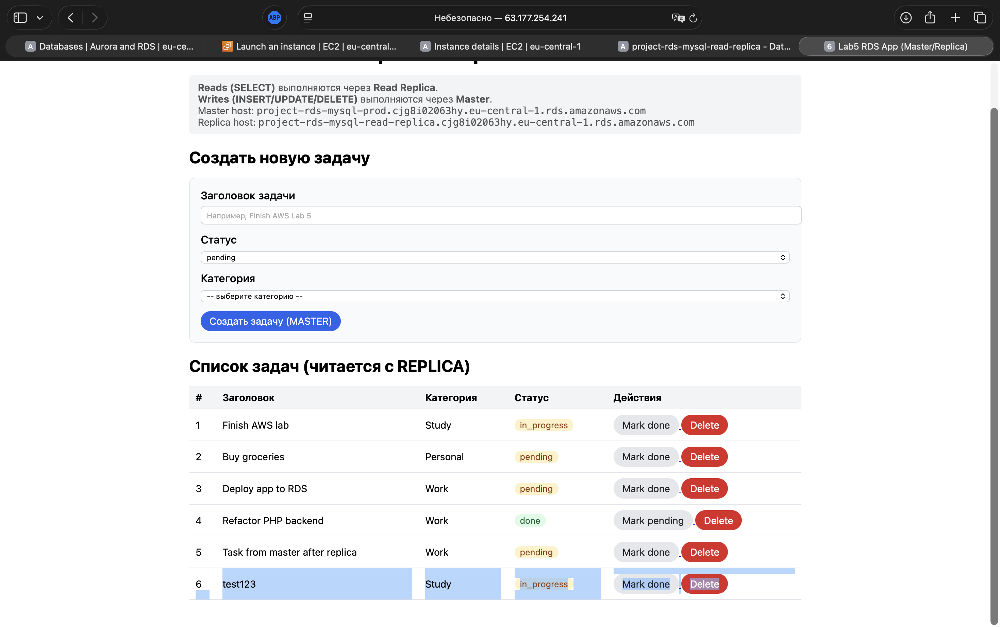

---

### Шаг 7. Terraform (DevOps часть) — автоматизация SG и EC2

Для специализации DevOps я использовал Terraform, чтобы описать:

- web-security-group
- db-mysql-security-group
- EC2-инстанс project-ec2-web

#### 7.1. Подготовка Terraform проекта

На macOS:

```bash
brew install terraform

mkdir -p ~/aws-cloud-assignments/lab5_rds_dynamo
cd ~/aws-cloud-assignments/lab5_rds_dynamo
```

Создал файлы:

```
.
├── main.tf
├── variables.tf
└── outputs.tf
```

---

#### 7.2. main.tf — провайдер, SG, EC2

Пример содержимого main.tf (адаптируется под реальные IDs VPC/subnet):

```hcl
terraform {
  required_providers {
    aws = {
      source  = "hashicorp/aws"
      version = "~> 5.0"
    }
  }
}

provider "aws" {
  region = "eu-central-1"
}

# Находим нужную VPC по ID
data "aws_vpc" "project_vpc" {
  filter {
    name   = "vpc-id"
    values = ["vpc-08fddf5015c99f2eb"] # <-- твой VPC ID
  }
}

# Публичные сабнеты (если есть тег aws-cdk:subnet-type=public)
data "aws_subnets" "public" {
  filter {
    name   = "vpc-id"
    values = [data.aws_vpc.project_vpc.id]
  }
}

# Security Group для веб-сервера
resource "aws_security_group" "web" {
  name        = "web-security-group-tf"
  description = "Web SG via Terraform"
  vpc_id      = data.aws_vpc.project_vpc.id

  ingress {
    description = "HTTP"
    from_port   = 80
    to_port     = 80
    protocol    = "tcp"
    cidr_blocks = ["0.0.0.0/0"]
  }

  ingress {
    description = "SSH"
    from_port   = 22
    to_port     = 22
    protocol    = "tcp"
    cidr_blocks = ["0.0.0.0/0"] # для продакшена лучше My IP
  }

  egress {
    from_port   = 0
    to_port     = 0
    protocol    = "-1"
    cidr_blocks = ["0.0.0.0/0"]
  }
}

# Security Group для RDS MySQL
resource "aws_security_group" "db" {
  name        = "db-mysql-security-group-tf"
  description = "DB SG via Terraform"
  vpc_id      = data.aws_vpc.project_vpc.id

  ingress {
    description     = "MySQL from web SG"
    from_port       = 3306
    to_port         = 3306
    protocol        = "tcp"
    security_groups = [aws_security_group.web.id]
  }

  egress {
    from_port   = 0
    to_port     = 0
    protocol    = "-1"
    cidr_blocks = ["0.0.0.0/0"]
  }
}

# EC2 для подключения к RDS
resource "aws_instance" "web" {
  ami                    = "ami-089xxxxxxecc4" # Amazon Linux 2023 в eu-central-1
  instance_type          = "t3.micro"
  subnet_id              = data.aws_subnets.public.ids[0]
  vpc_security_group_ids = [aws_security_group.web.id]

  key_name = "project-ec2-web"

  user_data = <<-EOF
              #!/bin/bash
              dnf update -y
              dnf install -y mariadb105
              EOF

  tags = {
    Name = "project-ec2-web-tf"
  }
}
```

---

#### 7.3. variables.tf — входные параметры

Я заполнял эти переменные через terraform.tfvars или при запуске terraform apply -var ....

---

#### 7.4. outputs.tf — полезные выходные значения

```hcl
output "web_instance_public_ip" {
  description = "Public IP of the web EC2 instance"
  value       = aws_instance.web.public_ip
}

output "web_sg_id" {
  description = "ID of web security group"
  value       = aws_security_group.web_sg.id
}

output "db_sg_id" {
  description = "ID of db security group"
  value       = aws_security_group.db_sg.id
}
```

---

#### 7.5. Запуск Terraform: init, plan, apply

В каталоге Terraform:

```bash
terraform init
terraform plan

terraform apply
```

Подтвердил yes.

> 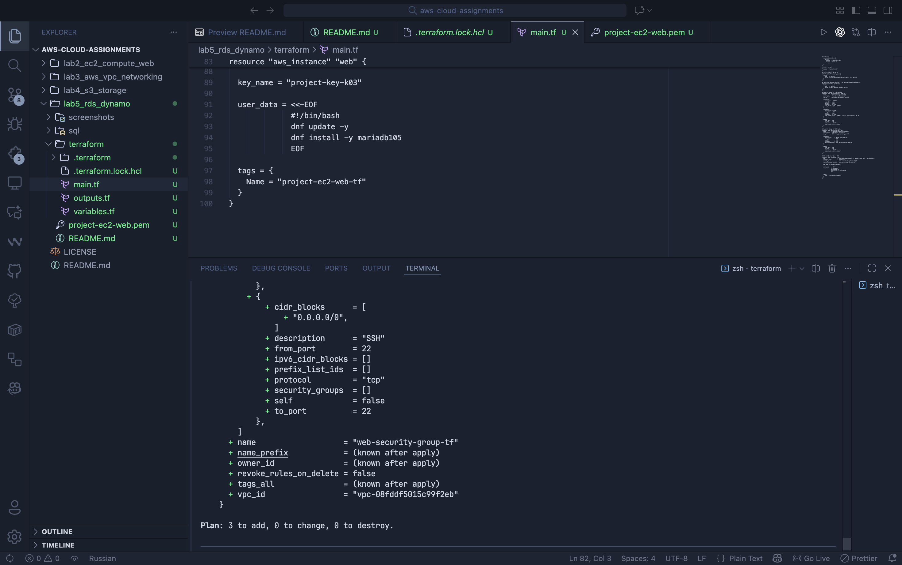

> 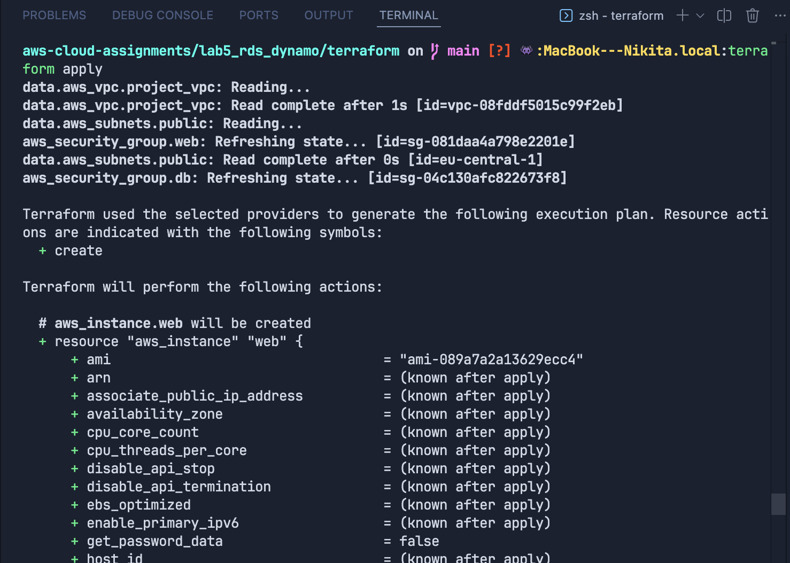

После этого в AWS Console я видел, что:

- SG web-security-group и db-mysql-security-group созданы Terraform.
- EC2-инстанс project-ec2-web появился с нужными настройками.

---

## 🧩 Дополнительный раздел. Практическая работа с Amazon DynamoDB

⸻

### 8. Дополнительное задание: Amazon DynamoDB

В этом дополнительном шаге я выполнил практическую часть по **Amazon DynamoDB**, чтобы сравнить работу с NoSQL-хранилищем и реляционной БД RDS, а также связать модель данных.

⸻

#### 8.1. Проектирование таблицы DynamoDB

**Задача по заданию:** Спроектировать таблицу для хранения данных приложения (например, задач / todos), выбрать Primary Key (и при необходимости Sort Key) и обосновать выбор.

Я спроектировал таблицу:

- **Table name:** lab5_todos
- **Primary key (Partition key):** user_id (тип String)
- **Sort key:** todo_id (тип String)

**Дополнительные атрибуты** (без явной схемы — DynamoDB является schemaless, схема задаётся на уровне приложения):

- **title** (String) — текст задачи
- **status** (String) — pending / in_progress / done
- **title** (String) — строковое название категории (Work, Study, Personal и т.д.)
- **status** (Number / String) — cтатус задачи

**Обоснование выбора ключей:**

- В качестве **Partition key (user_id)** я использовал идентификатор пользователя, чтобы все его задачи хранились логически в одном разделе. Это упрощает типичную выборку «все задачи конкретного пользователя».
- В качестве **Sort key (todo_id)** — уникальный идентификатор задачи (например, UUID или инкремент, генерируемый приложением). Это позволяет:
  - Однозначно идентифицировать задачу внутри пользователя.
  - Выполнять выборки по диапазонам (при необходимости — по префиксам, по сортировке и т.д.).

Таким образом, в отличие от реляционного варианта (categories + todos + FK), в DynamoDB я сознательно денормализовал модель и храню категорию (category) прямо в записи задачи, чтобы избежать JOIN.

> 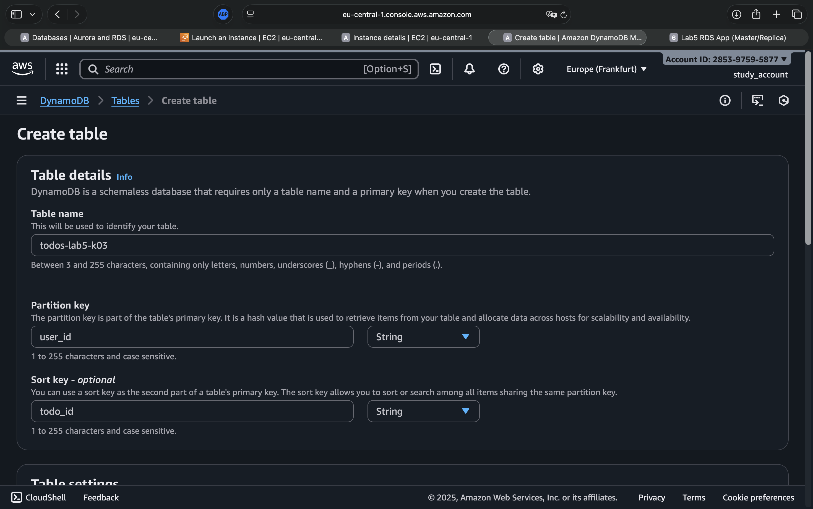

⸻

#### 8.2. Создание таблицы в AWS Console

1. В AWS Console в строке поиска набрал **DynamoDB** и открыл сервис.
2. Перешёл на вкладку **Tables → Create table**.
3. Заполнил параметры:
   - **Table name:** lab5_todos
   - **Partition key:** user_id (Type: String)
   - **Sort key:** todo_id (Type: String)
   - **Table settings:** оставил по умолчанию (on-demand capacity, авто-скейлинг), т.к. это учебная таблица.
4. Нажал **Create table** и дождался, когда статус сменится на **Active**.

> 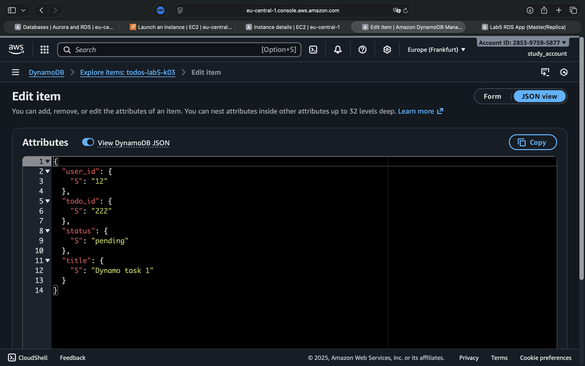

⸻

#### 8.3. Вставка записей (Create) через консоль

Далее я добавил несколько записей (items), соответствующих задачам, которые уже есть в RDS. Для этого:

1. Открыл таблицу **lab5_todos → вкладка Explore table items**.
2. Нажал **Create item**.
3. Заполнил атрибуты, например:

   **Запись 1:**

   - user_id: "12"
   - todo_id: "222"
   - title: "Dynamo task 1"
   - status: "pending"

4. Сохранил элементы, убедился, что они появились в списке.

---

## ❓ Контрольные вопросы и мои ответы

| №   | Вопрос                                                                    | Ответ                                                                                                                                                                                                                                                                                                                                                                                                                                                                                                                                                                                    |
| --- | ------------------------------------------------------------------------- | ---------------------------------------------------------------------------------------------------------------------------------------------------------------------------------------------------------------------------------------------------------------------------------------------------------------------------------------------------------------------------------------------------------------------------------------------------------------------------------------------------------------------------------------------------------------------------------------- |
| 1   | Что такое Subnet Group и зачем она нужна для RDS?                         | Subnet Group — это логическая группа подсетей в одной VPC. RDS использует её, чтобы размещать инстансы в заданных подсетях (обычно приватных и в разных AZ). Без Subnet Group база не знает, в каких подсетях ему разрешено поднимать базы.                                                                                                                                                                                                                                                                                                                                              |
| 2   | Почему для базы данных мы включили автоматизированные бэкапы?             | Автоматизированные бэкапы обязательны для создания Read Replica, а также позволяют откатывать базу к конкретному моменту времени (Point-in-Time Recovery). Для продакшена это критично, для лаб — обязательно по условию.                                                                                                                                                                                                                                                                                                                                                                |
| 3   | Зачем web-security-group и db-mysql-security-group разделены?             | Разделение SG позволяет: • Явно ограничить, кто может подключаться к БД (только web-security-group). • Применять принцип наименьших привилегий. • Сократить поверхность атаки: БД не доступна ни из Интернета, ни с других инстансов, не входящих в web-security-group.                                                                                                                                                                                                                                                                                                                  |
| 4   | Что такое Read Replica и зачем она нужна?                                 | Read Replica — это копия RDS-инстанса в режиме read-only, которая асинхронно реплицирует данные с master. Используется для: • Масштабирования чтения (перенос SELECT-запросов на реплику). • Повышения отказоустойчивости (при сбое мастер можно превратить реплику в новый мастер). • Отделения аналитических/тяжёлых запросов от основного OLTP-трафика.                                                                                                                                                                                                                               |
| 5   | Получилось ли выполнить запись (INSERT) на Read Replica? Почему?          | Нет, запись не прошла. Read Replica работает в режиме read-only, поэтому любые попытки INSERT/UPDATE/DELETE завершаются ошибкой. Все операции записи должны идти на master-инстанс.                                                                                                                                                                                                                                                                                                                                                                                                      |
| 6   | Почему данные, добавленные на master, спустя время появляются на реплике? | Потому что между master и репликой настроена асинхронная репликация на уровне движка MySQL. Все изменения записей на master транслируются на реплику, поэтому через небольшой лаг данные становятся идентичными.                                                                                                                                                                                                                                                                                                                                                                         |
| 7   | Как в приложении реализовано разделение чтения и записи?                  | В PHP-приложении: • В файле config.php прописаны два набора параметров: для master и replica. • В db.php есть две функции: • get_master_pdo() — соединение с project-rds-mysql-prod, используется в create_todo, update_todo_status, delete_todo. • get_replica_pdo() — соединение с project-rds-mysql-read-replica, используется в load_categories и load_todos. • Таким образом: • Все INSERT/UPDATE/DELETE → master. • Все SELECT → replica.                                                                                                                                          |
| 8   | В чём отличие RDS (MySQL) от DynamoDB (в контексте этой лабораторки)?     | Кратко: • RDS MySQL: • Реляционная модель, таблицы, связи (FK). • SQL, JOIN, транзакции, нормализация. • Подходит для структурированных, связанных данных (категории + задачи, финансы, учёт). • Вертикальное/горизонтальное масштабирование через Read Replicas, шардинг, и т.д. • DynamoDB: • NoSQL (Key-Value / документная модель). • Нет JOIN, связи моделируются через денормализацию. • Очень высокая масштабируемость и низкая задержка. • Разумна, когда основные операции — простые чтения/записи по ключу (например, логины, сессии, кэш пользовательских настроек, события). |
| 9   | Сценарий совместного использования RDS и DynamoDB в одном приложении      | Пример: • RDS MySQL: • Хранит критичные транзакционные данные: пользователи, заказы, платежи, связи между таблицами. • Требуются SQL-запросы, строгая консистентность, сложные JOIN. • DynamoDB: • Хранит: • Журналы действий (activity feed). • Кэши агрегированных данных. • Настройки пользователей, сессионные данные, быстро изменяемые метаданные. Такое разделение даёт: • Возможность разгрузить реляционную БД. • Масштабировать “горячие” ключевые операции чтения/записи в DynamoDB. • При этом сохранить строгую реляционную модель для финансовых и критичных данных в RDS. |

---

## Сводная таблица скриншотов

| №   | Что должно быть видно                                                                                           | Путь                                             |
| --- | --------------------------------------------------------------------------------------------------------------- | ------------------------------------------------ |
| 00  | Общая архитектура (VPC + RDS + Replica + EC2 + SG)                                                              | screenshots/lab5_00\_\_architecture_overview.png |
| 01  | Регион eu-central-1 (Frankfurt) выбран, в списке VPC отображается project-vpc                                   | screenshots/lab5_01\_\_region_and_vpc.png        |
| 02  | Список подсетей: две публичные и две приватные подсети в project-vpc                                            | screenshots/lab5_02\_\_vpc_subnets.png           |
| 03  | Созданная web-security-group с разрешённым HTTP/SSH inbound                                                     | screenshots/lab5_03\_\_web_sg.png                |
| 04  | Security Group db-mysql-security-group, разрешающий MySQL только от web-security-group                          | screenshots/lab5_04\_\_db_sg.png                 |
| 05  | Outbound-правило web-security-group, разрешающее MySQL трафик к db-mysql-security-group                         | screenshots/lab5_05\_\_web_sg_egress.png         |
| 06  | Subnet Group project-rds-subnet-group, содержащая две приватные подсети                                         | screenshots/lab5_06\_\_rds_subnet_group.png      |
| 07  | Основной экземпляр project-rds-mysql-prod в статусе Available                                                   | screenshots/lab5_07\_\_rds_prod_created.png      |
| 08  | Endpoint основного RDS-инстанса, который использую для подключения с EC2                                        | screenshots/lab5_08\_\_rds_prod_endpoint.png     |
| 09  | EC2-инстанс project-ec2-web в публичной подсети с привязанной web-security-group                                | screenshots/lab5_09\_\_ec2_created.png           |
| 10  | SSH-сессия на EC2, установка httpd/php/mariadb screenshots/lab5_10\*\*ssh_and_apache.png                        |
| 11  | Подключение mysql с EC2 к RDS master screenshots/lab5_11\*\*mysql_connect_rds.png                               |
| 12  | Создание таблиц categories и todos screenshots/lab5_12\*\*create_tables.png                                     |
| 13  | Результат JOIN-запроса screenshots/lab5_13\*\*select_join.png                                                   |
| 14  | Read Replica project-rds-mysql-read-replica в статусе Available screenshots/lab5_14\*\*read_replica_created.png |
| 15  | Endpoint Read Replica screenshots/lab5_15\*\*read_replica_endpoint.png                                          |
| 16  | SELECT на реплике с данными screenshots/lab5_16\*\*select_on_replica.png                                        |
| 17  | Ошибка INSERT на Read Replica screenshots/lab5_17\*\*insert_on_replica_error.png                                |
| 18  | Новая запись с master появилась на реплике screenshots/lab5_18\*\*new_record_on_replica.png                     |
| 19  | Структура lab5_app на EC2 screenshots/lab5_19\*\*lab5_app_structure.png                                         |
| 20  | config.php с host master/replica screenshots/lab5_20\*\*config_php.png                                          |
| 21  | db.php с функциями master/replica screenshots/lab5_21\*\*db_php.png                                             |
| 22  | UI index.php с формой и таблицей задач screenshots/lab5_22\*\*index_php_ui.png                                  |
| 23  | Приложение в браузере (созданные задачи) screenshots/lab5_23\*\*web_app_in_browser.png                          |
| 24  | Структура Terraform проекта screenshots/lab5_24\*\*terraform_structure.png                                      |
| 25  | variables.tf screenshots/lab5_25\*\*terraform_variables.png                                                     |
| 26  | outputs.tf screenshots/lab5_26\*\*terraform_outputs.png                                                         |
| 27  | terraform plan screenshots/lab5_27\*\*terraform_plan.png                                                        |
| 28  | terraform apply с созданными ресурсами и public IP screenshots/lab5_28\_\_terraform_apply.png                   |

---

## 🧾 Полезные команды (конспект)

**Локально (macOS):**

```bash
# Подключение к EC2
chmod 400 student-key-k22.pem
ssh -i student-key-k22.pem ec2-user@<EC2_PUBLIC_IP>

# Terraform
cd ~/projects/aws-lab5-terraform
terraform init
terraform plan -var="..." ...
terraform apply -var="..." ...
terraform destroy # при необходимости удалить ресурсы
```

**На EC2:**

```bash
# Установка пакетов
sudo dnf update -y
sudo dnf install -y mariadb105 httpd php php-mysqlnd

sudo systemctl enable httpd
sudo systemctl start httpd

# Подключение к master
mysql -h project-rds-mysql-prod.xxxxxxxx.eu-central-1.rds.amazonaws.com -u admin -p

# Подключение к replica
mysql -h project-rds-mysql-read-replica.xxxxxxxx.eu-central-1.rds.amazonaws.com -u admin -p
```

---

## ✅ Вывод

**В рамках Лабораторной работы №5 я:**

1. **Подготовил облачную инфраструктуру в AWS:**

   - **Использовал существующую VPC** с публичными и приватными подсетями.
   - **Создал две Security Group** (web-security-group и db-mysql-security-group) по принципу наименьших привилегий.

2. **Развернул Amazon RDS MySQL:**

   - **Основной инстанс** project-rds-mysql-prod в приватных подсетях.
   - **Настроил Subnet Group**, бэкапы, параметры инстанса.

3. **Создал Read Replica** project-rds-mysql-read-replica и протестировал:

   - **Успешное чтение данных** с реплики.
   - **Ошибку записи** на реплику (ожидаемо).
   - **Появление новых записей** после их создания на master.

4. **С EC2-инстанса настроил подключение к RDS:**

   - **Создал таблицы** categories и todos со связью one-to-many.
   - **Выполнил INSERT и SELECT** (включая JOIN).

5. **Реализовал простое PHP-приложение (6a):**

   - **Разделил подключения по ролям:**
     - master — для write (INSERT/UPDATE/DELETE).
     - replica — для read (SELECT).
   - **Сделал веб-интерфейс** для создания, просмотра, изменения статуса и удаления задач.

6. **Для специализации DevOps описал инфраструктуру как код с помощью Terraform:**

   - **Автоматизировал создание** Security Groups и EC2-инстанса.
   - **Использовал terraform plan/apply** для управления ресурсами.

7. **Теоретически разобрал отличие RDS и DynamoDB**, а также сценарии их совместного использования.
