# ☁️ Лабораторная работа №6

## Балансировка нагрузки и авто-масштабирование в AWS

### VPC • ALB • Auto Scaling Group • CloudWatch • Terraform (DevOps-бонус)

---

### Студент

- **Имя и фамилия:** Савка Никита (Savca Nichita)
- **Группа:** I2302
- **Специализация:** DevOps
- **Рабочая станция:** macOS (Apple Silicon) • VS Code • встроенный терминал (zsh)
- **Среда выполнения:**  
  • AWS Management Console (основная часть)  
  • Terraform 1.6+ (DevOps-дополнение)
- **Регион AWS:** EU (Frankfurt) – `eu-central-1`
- **Дата выполнения:** ноябрь–декабрь 2025
- **Формат сдачи:** `README.md` + папка `screenshots/`

---

## Цель и задачи работы

Собрать в AWS **полностью отказоустойчивую и автоматически масштабируемую** архитектуру:

1. VPC с 2 публичными и 2 приватными подсетями в разных AZ
2. EC2-инстанс с nginx → создание AMI → Launch Template
3. Target Group с health-check
4. Application Load Balancer (Internet-facing)
5. Auto Scaling Group в приватных подсетях (min 2 / max 4)
6. Target Tracking Scaling Policy по метрике ASGAverageCPUUtilization = 50%
7. Нагрузочное тестирование → наблюдение Scale Out / Scale In
8. Полная очистка всех ресурсов
9. **DevOps-дополнение:** вся инфраструктура как код через Terraform

---

## Полная архитектура (что было построено)

```
Internet
   ↓
Application Load Balancer project-alb (public subnets, internet-facing)
   ↓
Target Group project-target-group (health-check /)
   ↓
EC2 инстансы из ASG project-auto-scaling-group
      (private subnets, без публичных IP, nginx + вывод instance-id)
```

**Скриншот 00** – общая схема архитектуры (Resource map)  
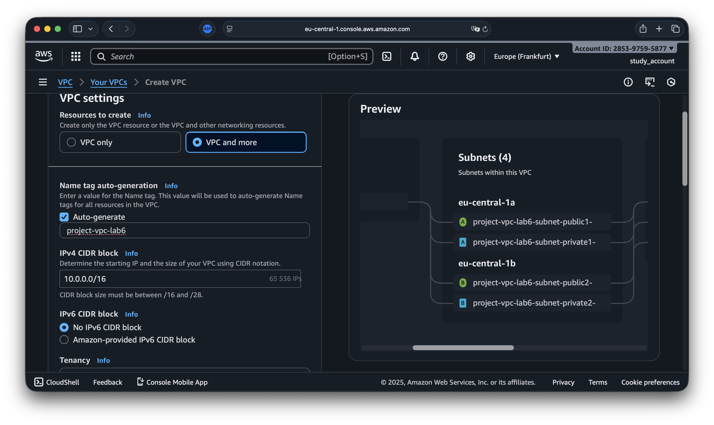

---

## Пошаговое выполнение через AWS Management Console

### 1. Создание VPC и сетевой инфраструктуры (мастер «VPC and more»)

- Name tag auto-generation: `project-vpc-lab6`
- IPv4 CIDR: `10.0.0.0/16`
- Availability Zones: 2
- Public subnets: 2
- Private subnets: 2
- NAT gateways: In 1 AZ

Автоматически созданы: IGW, NAT GW, EIP, 2 Route Tables.

**Скриншот 01** – VPC и ресурсы после мастера  
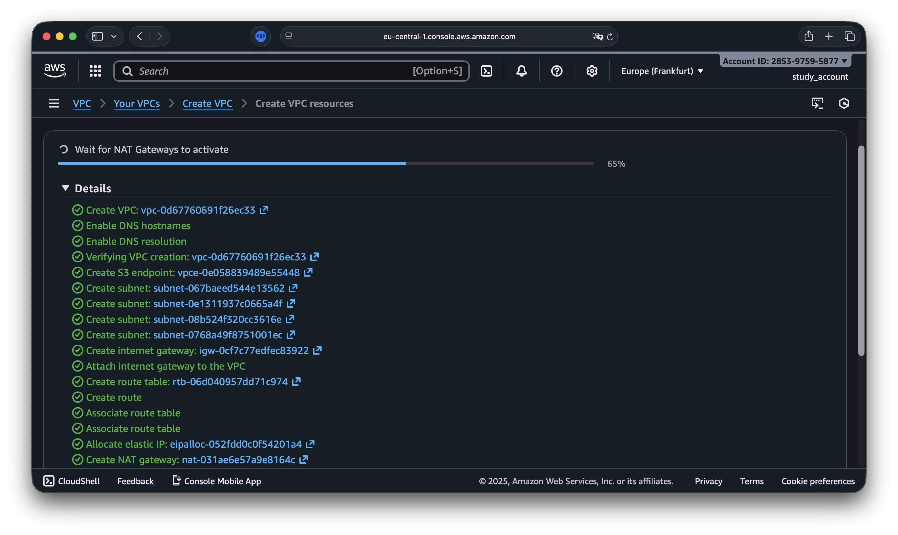

**Скриншот 02** – список подсетей (2 public + 2 private)  
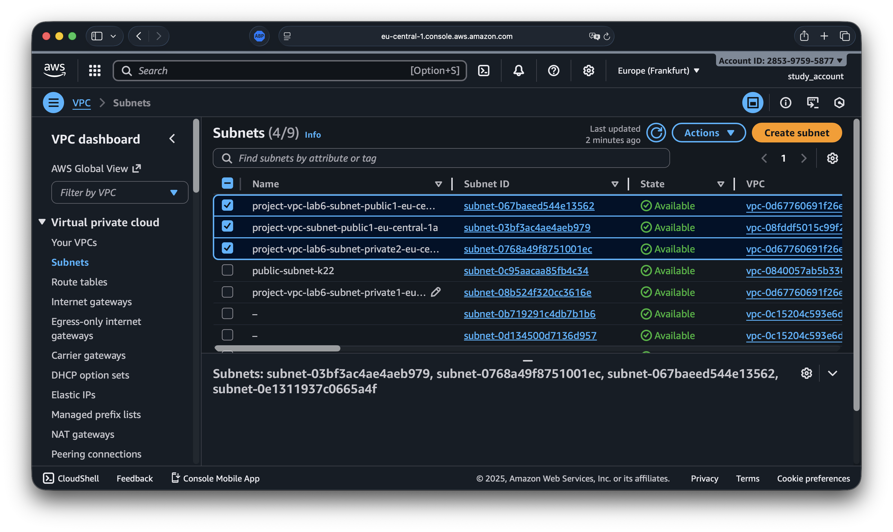

**Скриншот 03** – public Route Table: 0.0.0.0/0 → IGW  
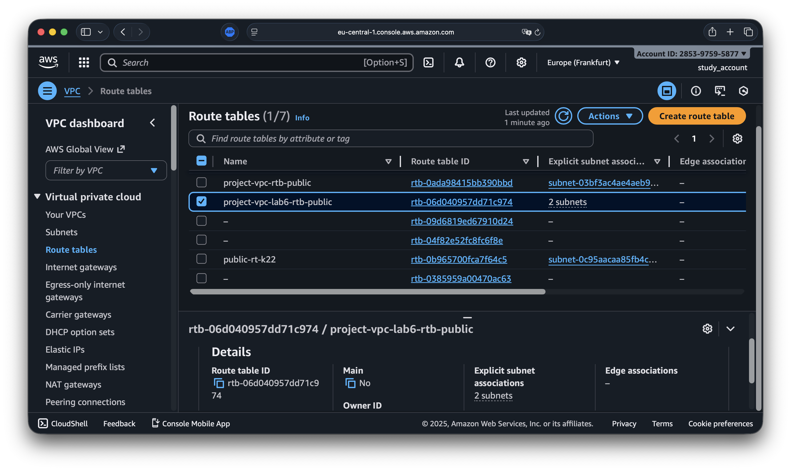

### 2. Запуск первого EC2-инстанса (для создания AMI)

- Name: `lab6-web-instance`
- AMI: Amazon Linux 2 (HVM) SSD
- Instance type: t3.micro
- Subnet: одна из public подсетей
- Auto-assign public IP: Enable
- Security Group `lab6-web-sg`:  
  → SSH (22) – My IP  
  → HTTP (80) – 0.0.0.0/0
- **Detailed CloudWatch monitoring: Enabled**
- User data (установка nginx + вывод instance-id):

```bash
#!/bin/bash
yum update -y
amazon-linux-extras install nginx -y
systemctl enable nginx
systemctl start nginx

INSTANCE_ID=$(curl -s -H "X-aws-ec2-metadata-token: $TOKEN" \
  http://169.254.169.254/latest/meta-data/instance-id)

echo "<h1>Lab6 Nginx - instance: $INSTANCE_ID</h1>" > /usr/share/nginx/html/index.html
```

**Скриншот 04** – форма запуска инстанса (все настройки + user data)  
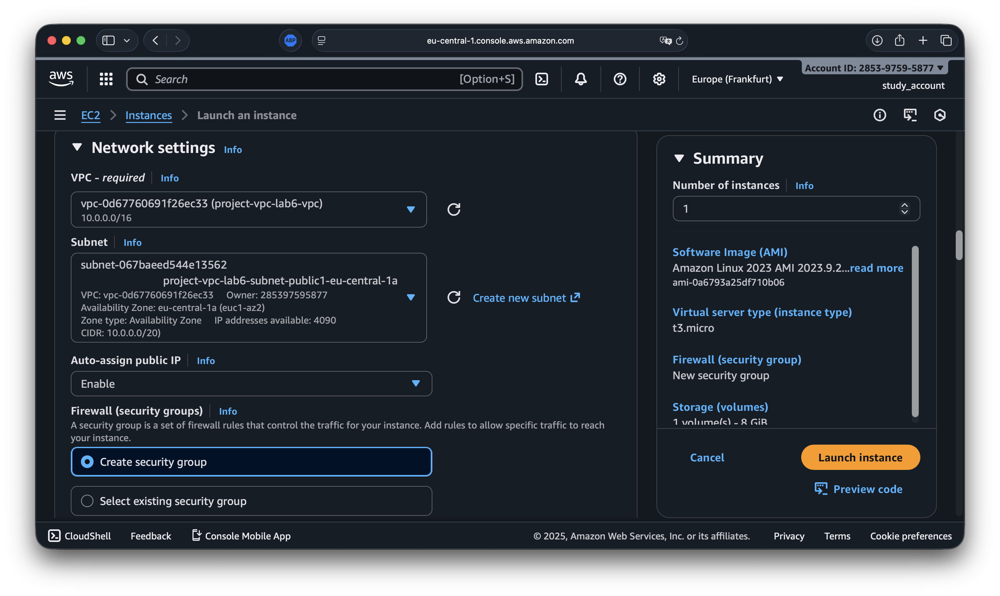

**Скриншот 05** – страница nginx по публичному IP инстанса  
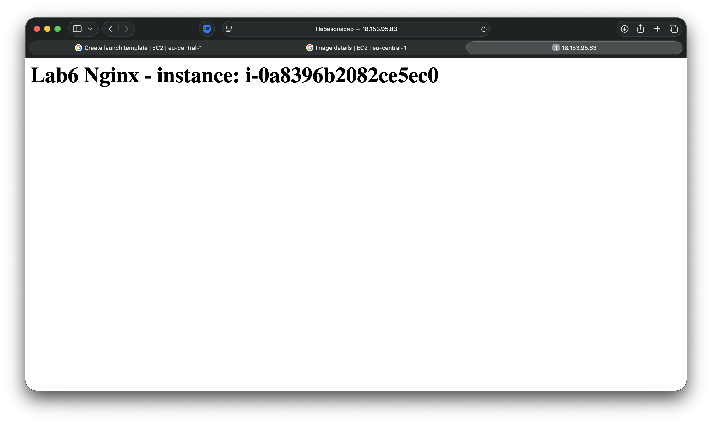

### 3. Создание AMI из настроенного инстанса

EC2 → Instances → выбр. `lab6-web-instance` → Actions → Image and templates → Create image

- Image name: `project-web-server-ami`

**Скриншот 06** – AMI в статусе available  
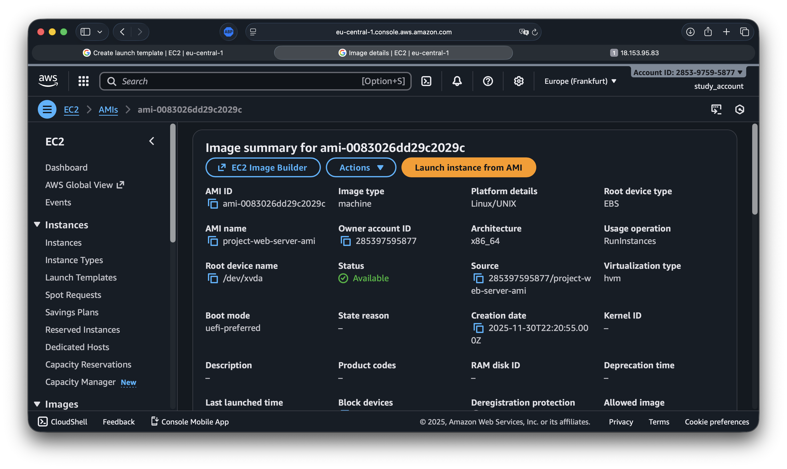

### 4. Создание Launch Template

- Name: `project-launch-template`
- AMI: `project-web-server-ami`
- Instance type: t3.micro
- Key pair: `project-ec2-web`
- Security group: `lab6-web-sg`
- Monitoring: **Detailed monitoring enabled**

**Скриншот 07** – Launch Template (все параметры)  
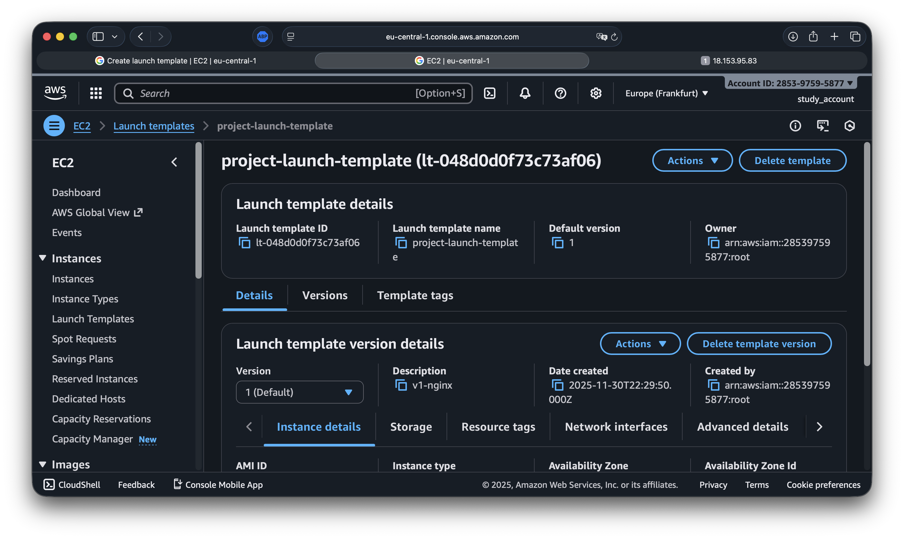

### 5. Создание Target Group

- Name: `project-target-group`
- Target type: Instances
- Protocol: HTTP, Port: 80
- VPC: `project-vpc-lab6`
- Health check path: `/`

**Скриншот 08** – Target Group  
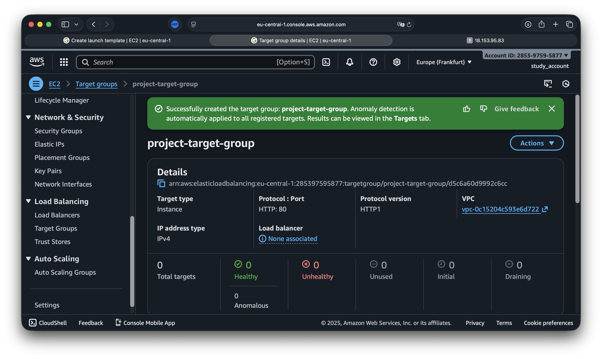

### 6. Создание Application Load Balancer

- Name: `project-alb`
- Scheme: Internet-facing
- IP address type: IPv4
- Subnets: 2 публичные
- Security group: `lab6-web-sg`
- Listener: HTTP:80 → Forward to `project-target-group`

**Скриншот 09** – ALB создан (internet-facing)  
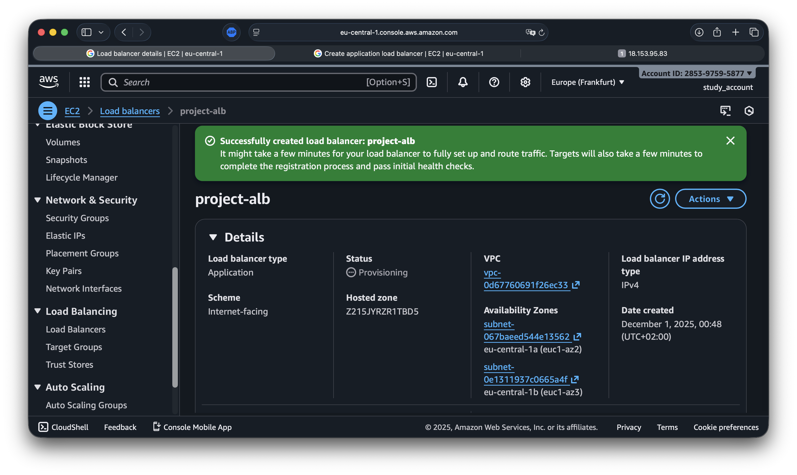

### 7. Создание Auto Scaling Group

- Name: `project-auto-scaling-group`
- Launch template: `project-launch-template` (latest)
- VPC + только 2 private subnets
- Desired capacity: 2 / Min: 2 / Max: 4
- Attach to existing load balancer → `project-target-group`
- Scaling policy: **Target tracking**  
  → Metric type: ASGAverageCPUUtilization  
  → Target value: **50%**  
  → Instance warm-up: **60 секунд**
- Group metrics collection in CloudWatch: Enabled
- Availability Zone distribution: Balanced best effort

**Скриншот 11** – инстансы ASG в приватных подсетях (без публичных IP)  


### 8. Проверка работы через ALB

Открыл в браузере:  
`http://project-alb-XXXXXXXX.eu-central-1.elb.amazonaws.com/`

→ Получил страницу nginx от инстансов ASG  
→ При обновлении меняется `instance-id` → балансировка работает

**Скриншот 12** – nginx через ALB (виден instance-id)  
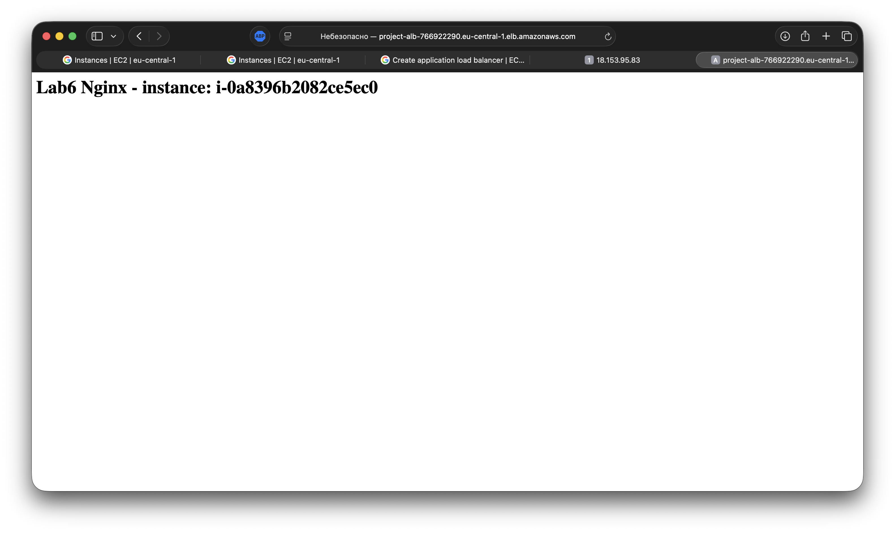

**Скриншот 13** – Target Group: все инстансы healthy  
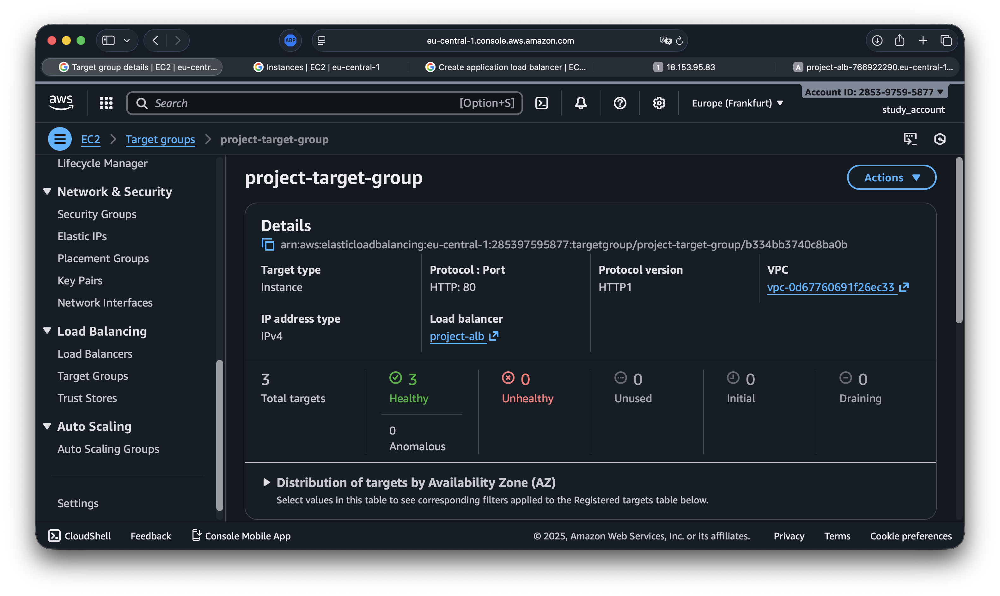

### 9. Нагрузочное тестирование и авто-масштабирование

**Скриншот 14** – CloudWatch Alarm до нагрузки (CPU ≈ 0–5%)  
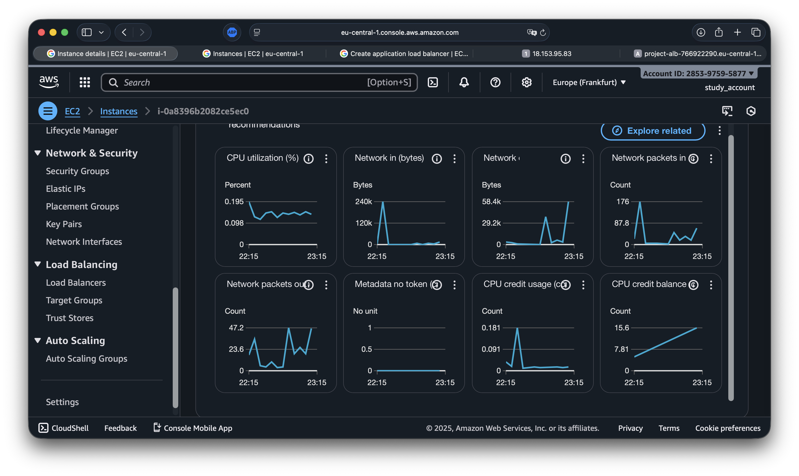

Скрипт нагрузки `curl.sh`:

```bash
#!/bin/bash
HOST="$1"
THREADS="${2:-30}"
DURATION="${3:-120}"

if [ -z "$HOST" ]; then
  echo "Usage: $0 <alb_dns_name> [threads] [duration]"
  exit 1
fi

echo "Starting load: $THREADS threads × $DURATION seconds"
for i in $(seq 1 $THREADS); do
  (
    end=$((SECONDS + DURATION))
    while [ $SECONDS -lt $end ]; do
      curl -s "http://$HOST/" > /dev/null
    done
  ) &
done
wait
echo "Load finished"
```

Запуск: `./curl.sh project-alb-....elb.amazonaws.com 30 120`

Через 2–3 минуты:

- CPU > 50% → AlarmHigh = ALARM
- ASG Activity → Launching new instances (Scale Out)

**Скриншот 18** – 3 инстанса после масштабирования  
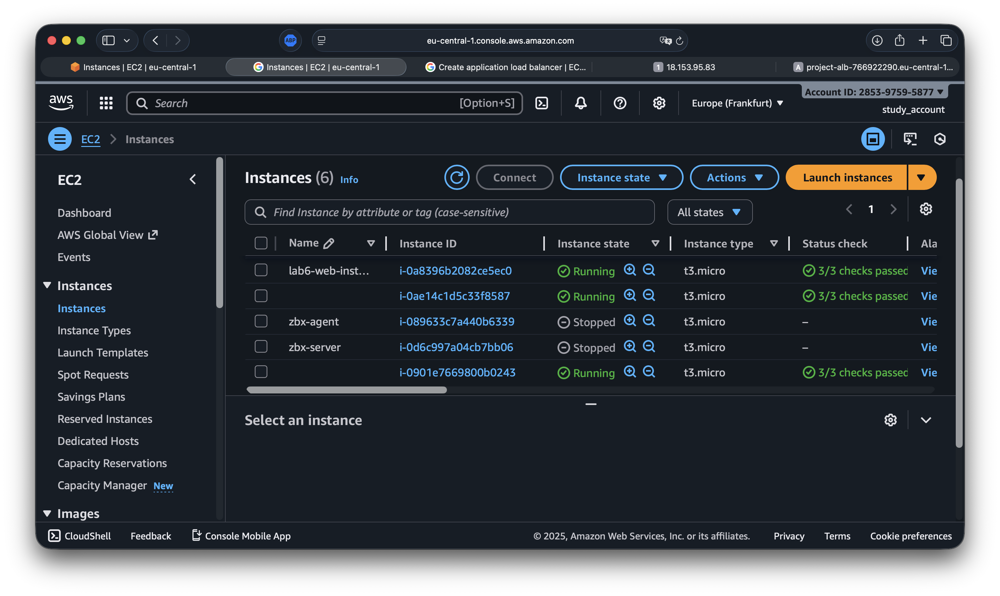

После окончания нагрузки → Scale In → возврат к 2 инстансам

### 10. Полная очистка ресурсов через AWS Console

Порядок удаления:

1. Load Balancer → Delete
2. Target Group → Delete
3. Auto Scaling Group → Delete (с удалением инстансов)
4. AMI → Deregister + удалить snapshots
5. Launch Template → Delete
6. NAT Gateway + освободить EIP
7. Subnets → Delete
8. Internet Gateway → Detach + Delete
9. VPC → Delete

---

## DevOps-дополнение: 100% автоматизация через Terraform

После выполнения задания через UI я **полностью повторил** архитектуру с помощью Terraform (Infrastructure as Code).

Структура проекта:

```
lab6_terraform/
├── main.tf          # VPC, subnets, IGW, NAT, 2 SG, ALB, TG, LT, ASG, policy
├── variables.tf
├── outputs.tf
├── terraform.tfvars
└── screenshots/
```

Что создаётся Terraform’ом:

- VPC `project-vpc-lab6` + 2 public + 2 private subnets
- IGW + NAT GW + EIP + Route Tables
- 2 Security Groups:
  - `lab6-alb-sg` (HTTP 80 от 0.0.0.0/0)
  - `lab6-ec2-sg` (HTTP 80 только от ALB SG + SSH от моего CIDR)
- Target Group
- Internet-facing ALB в public subnets
- Launch Template с тем же user_data (nginx + instance-id)
- ASG в private subnets, min=2 max=4
- Target Tracking Policy CPU = 50%, warm-up 60s
- Outputs: `alb_dns_name`, `vpc_id`, subnet IDs и др.

Команды:

```bash
cd lab6_terraform
terraform init
terraform plan      # показывает ~45 ресурсов
terraform apply -auto-approve

terraform destroy -auto-approve
```

---

## Контрольные вопросы и полные ответы

| №   | Вопрос                                                                              | Ответ                                                                                                                                                                                                                                                                                                             |
| --- | ----------------------------------------------------------------------------------- | ----------------------------------------------------------------------------------------------------------------------------------------------------------------------------------------------------------------------------------------------------------------------------------------------------------------- |
| 1   | Что такое AMI и чем отличается от snapshot? Какие варианты использования AMI?       | AMI (Amazon Machine Image) — полный образ виртуальной машины (ОС + диски + ПО). Snapshot — снимок одного EBS-тома. AMI обычно состоит из одного или нескольких snapshot’ов. Использование AMI: быстрый запуск одинаковых инстансов, «золотой образ» веб-сервера, основа для Launch Template / Auto Scaling Group. |
| 2   | Что такое Launch Template и зачем он нужен? Чем отличается от Launch Configuration? | Launch Template — современный шаблон параметров запуска EC2 (AMI, тип, SG, user data, мониторинг и др.), поддерживает версии. Launch Configuration — устаревший механизм без версионирования и части возможностей. AWS официально рекомендует использовать именно Launch Template.                                |
| 3   | Зачем нужен и какую роль выполняет Target Group?                                    | Target Group — это список backend-целей (инстансов), на которые ALB распределяет трафик. В нём задаются health-checks и порт. ASG автоматически регистрирует/отключает инстансы в TG. Без Target Group ALB не знает, куда отправлять запросы.                                                                     |
| 4   | В чём разница между Internet-facing и Internal Load Balancer?                       | Internet-facing — имеет публичный DNS, доступен из Интернета (для внешних клиентов). Internal — доступен только внутри VPC (для внутренних микросервисов, приватных API). В работе использован Internet-facing.                                                                                                   |
| 5   | Что такое Default action и какие есть типы?                                         | Default action — действие, которое выполняет ALB, если запрос не подошёл ни под одно правило. Типы: forward (в TG), redirect (на другой URL), fixed-response (вернуть код/текст), authenticate (OIDC/Cognito). В этой работе — forward в `project-target-group`.                                                  |
| 6   | Почему для Auto Scaling Group выбираются приватные подсети?                         | Чтобы backend-инстансы не были доступны напрямую из Интернета. Весь внешний трафик идёт только через ALB (public → private). Это лучшая практика безопасности и стандартная облачная архитектура.                                                                                                                 |
| 7   | Зачем нужна настройка Availability Zone distribution (Balanced best effort)?        | Равномерно распределяет инстансы по зонам доступности. При отказе одной AZ сервис продолжает работать на инстансах из оставшихся зон → высокая отказоустойчивость.                                                                                                                                                |
| 8   | Что такое Instance warm-up period и зачем он нужен?                                 | Время прогрева нового инстанса. В течение этого периода его метрики CPU не учитываются при расчёте средней загрузки группы. Это предотвращает ложные срабатывания масштабирования, когда только что запущенный инстанс имеет нестабильную нагрузку.                                                               |
| 9   | Какие IP-адреса видны при обращении к ALB и почему?                                 | Видны только публичные IP/DNS самого ALB. Backend-инстансы находятся в приватных подсетях и не имеют публичных IP → клиент их не видит. ALB сам знает их частные IP и маршрутизирует трафик внутрь VPC.                                                                                                           |
| 10  | Какую роль сыграл Auto Scaling в процессе тестирования нагрузки?                    | При CPU > 50% Target Tracking Policy увеличила desired capacity → ASG запустила новые инстансы (Scale Out). После окончания нагрузки и падения CPU ниже 50% — автоматически уменьшила количество инстансов (Scale In). Это обеспечивает автоматическую эластичность и экономию ресурсов.                          |

---

## Сводная таблица скриншотов (22 штуки)

| №   | Что видно                                                  | Файл                                 |
| --- | ---------------------------------------------------------- | ------------------------------------ |
| 00  | Общая схема архитектуры (Resource map)                     | `lab6_00__architecture_overview.png` |
| 01  | VPC после мастера VPC and more                             | `lab6_01__vpc_created.png`           |
| 02  | Список подсетей (2 public + 2 private)                     | `lab6_02__subnets.png`               |
| 03  | Public Route Table → IGW                                   | `lab6_03__public_rt_igw.png`         |
| 04  | Форма запуска первого инстанса (user data, SG, monitoring) | `lab6_04__launch_instance_form.png`  |
| 05  | Nginx по публичному IP                                     | `lab6_05__nginx_page.png`            |
| 06  | AMI project-web-server-ami (available)                     | `lab6_06__ami_created.png`           |
| 07  | Launch Template                                            | `lab6_07__launch_template.png`       |
| 08  | Target Group project-target-group                          | `lab6_08__target_group.png`          |
| 09  | ALB project-alb (internet-facing)                          | `lab6_09__alb_created.png`           |
| 10  | ASG project-auto-scaling-group (все параметры)             | `lab6_10__asg_created.png`           |
| 11  | Инстансы ASG в private subnets (без публичных IP)          | `lab6_11__asg_instances.png`         |
| 12  | Nginx через ALB (виден instance-id)                        | `lab6_12__alb_test.png`              |
| 13  | Target Group: все инстансы healthy                         | `lab6_13__tg_healthy.png`            |
| 14  | CloudWatch Alarm до нагрузки (низкий CPU)                  | `lab6_14__cw_alarm_idle.png`         |
| 15  | Запуск нагрузочного скрипта curl.sh                        | `lab6_15__curl_load.png`             |
| 16  | CPU > 50%, AlarmHigh в состоянии ALARM                     | `lab6_16__cw_alarm_high.png`         |
| 17  | ASG Activity: Scale Out                                    | `lab6_17__asg_scaled_out.png`        |
| 18  | 4 инстанса после масштабирования                           | `lab6_18__instances_scaled.png`      |
| 19  | Всё удалено (очистка ресурсов)                             | `lab6_19__cleanup_done.png`          |
| 20  | `terraform apply` + вывод alb_dns_name                     | `lab6_20__terraform_apply.png`       |
| 21  | Фрагмент main.tf в VS Code (VPC + ALB + ASG)               | `lab6_21__terraform_code.png`        |

---

## Выводы

Выполнено **все задания** + полноценный DevOps-уровень:

- Создана отказоустойчивая масштабируемая архитектура через AWS Console
- Реализовано горизонтальное авто-масштабирование по CPU (Target Tracking 50%)
- Проведён нагрузочный тест → наблюдали Scale Out и Scale In
- Все ресурсы полностью очищены
- Дополнительно реализована **полная автоматизация** через Terraform (IaC) — одна команда поднимает и удаляет всю инфраструктуру
